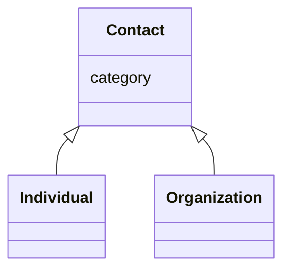

# Class: Contact


_A contact point for a resource or product._


URI: [kgr:Contact](https://w3id.org/bridge2ai/data-sheets-schema/Contact)





## Inheritance
* **Contact**
    * [Individual](Individual.html)
    * [Organization](Organization.html)


## Slots

| Name | Cardinality and Range | Description | Inheritance |
| ---  | --- | --- | --- |
| [category](category.html) | 0..1 <br/> [CategoryType](CategoryType.html) | The category of the entity | direct |


## Usages

| used by | used in | type | used |
| ---  | --- | --- | --- |
| [Resource](Resource.html) | [contacts](contacts.html) | range | [Contact](Contact.html) |
| [KnowledgeGraph](KnowledgeGraph.html) | [contacts](contacts.html) | range | [Contact](Contact.html) |
| [DataSource](DataSource.html) | [contacts](contacts.html) | range | [Contact](Contact.html) |
| [DataModel](DataModel.html) | [contacts](contacts.html) | range | [Contact](Contact.html) |
| [Aggregator](Aggregator.html) | [contacts](contacts.html) | range | [Contact](Contact.html) |
| [Product](Product.html) | [contacts](contacts.html) | range | [Contact](Contact.html) |
| [GraphProduct](GraphProduct.html) | [contacts](contacts.html) | range | [Contact](Contact.html) |
| [DataModelProduct](DataModelProduct.html) | [contacts](contacts.html) | range | [Contact](Contact.html) |
| [MappingProduct](MappingProduct.html) | [contacts](contacts.html) | range | [Contact](Contact.html) |
| [ProcessProduct](ProcessProduct.html) | [contacts](contacts.html) | range | [Contact](Contact.html) |
| [GraphicalInterface](GraphicalInterface.html) | [contacts](contacts.html) | range | [Contact](Contact.html) |
| [ProgrammingInterface](ProgrammingInterface.html) | [contacts](contacts.html) | range | [Contact](Contact.html) |
| [Usage](Usage.html) | [users](users.html) | range | [Contact](Contact.html) |


## Identifier and Mapping Information


### Schema Source


* from schema: https://w3id.org/knowledge-graph-hub/kg_registry_schema


## Mappings

| Mapping Type | Mapped Value |
| ---  | ---  |
| self | kgr:Contact |
| native | kgr:Contact |


## LinkML Source

<!-- TODO: investigate https://stackoverflow.com/questions/37606292/how-to-create-tabbed-code-blocks-in-mkdocs-or-sphinx -->

### Direct

<details>
```yaml
name: Contact
description: A contact point for a resource or product.
from_schema: https://w3id.org/knowledge-graph-hub/kg_registry_schema
slots:
- category

```
</details>

### Induced

<details>
```yaml
name: Contact
description: A contact point for a resource or product.
from_schema: https://w3id.org/knowledge-graph-hub/kg_registry_schema
attributes:
  category:
    name: category
    description: The category of the entity. This should be identical to its class
      name.
    from_schema: https://w3id.org/knowledge-graph-hub/kg_registry_schema
    rank: 1000
    is_a: type
    domain: NamedThing
    alias: category
    owner: Contact
    domain_of:
    - NamedThing
    - Contact
    range: category_type

```
</details>
