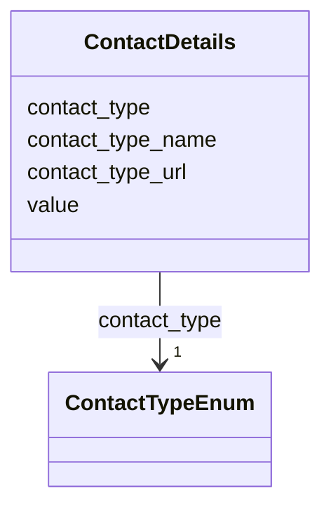

# Class: ContactDetails


_A field for details about how to contact a person or organization._


URI: [kgr:ContactDetails](https://w3id.org/bridge2ai/data-sheets-schema/ContactDetails)





<!-- no inheritance hierarchy -->


## Slots

| Name | Cardinality and Range | Description | Inheritance |
| ---  | --- | --- | --- |
| [contact_type](contact_type.html) | 1 <br/> [ContactTypeEnum](ContactTypeEnum.html) | The type of contact detail | direct |
| [contact_type_name](contact_type_name.html) | 0..1 <br/> [String](String.html) | The name of the contact detail, if the contact_type is "other" | direct |
| [contact_type_url](contact_type_url.html) | 0..1 <br/> [Uriorcurie](Uriorcurie.html) | The URL of the contact detail, if the contact_type is "other" | direct |
| [value](value.html) | 1 <br/> [String](String.html) | The value of the contact detail | direct |


## Usages

| used by | used in | type | used |
| ---  | --- | --- | --- |
| [Contact](Contact.html) | [contact_details](contact_details.html) | range | [ContactDetails](ContactDetails.html) |
| [Individual](Individual.html) | [contact_details](contact_details.html) | range | [ContactDetails](ContactDetails.html) |
| [Organization](Organization.html) | [contact_details](contact_details.html) | range | [ContactDetails](ContactDetails.html) |


## Identifier and Mapping Information


### Schema Source


* from schema: https://w3id.org/knowledge-graph-hub/kg_registry_schema


## Mappings

| Mapping Type | Mapped Value |
| ---  | ---  |
| self | kgr:ContactDetails |
| native | kgr:ContactDetails |


## LinkML Source

<!-- TODO: investigate https://stackoverflow.com/questions/37606292/how-to-create-tabbed-code-blocks-in-mkdocs-or-sphinx -->

### Direct

<details>
```yaml
name: ContactDetails
description: A field for details about how to contact a person or organization.
from_schema: https://w3id.org/knowledge-graph-hub/kg_registry_schema
attributes:
  contact_type:
    name: contact_type
    description: The type of contact detail.
    from_schema: https://w3id.org/knowledge-graph-hub/kg_registry_schema
    rank: 1000
    domain_of:
    - ContactDetails
    range: ContactTypeEnum
    required: true
  contact_type_name:
    name: contact_type_name
    description: The name of the contact detail, if the contact_type is "other". For
      example, if the contact value is a username at the Gumball Project's GitLab,
      this may be "Gumball Project GitLab".
    from_schema: https://w3id.org/knowledge-graph-hub/kg_registry_schema
    rank: 1000
    domain_of:
    - ContactDetails
    range: string
  contact_type_url:
    name: contact_type_url
    description: The URL of the contact detail, if the contact_type is "other". For
      example, if the contact value is a username at the Gumball Project's GitLab,
      this may be "https://gitlab.gumballproject.org/".
    from_schema: https://w3id.org/knowledge-graph-hub/kg_registry_schema
    rank: 1000
    domain_of:
    - ContactDetails
    range: uriorcurie
  value:
    name: value
    description: The value of the contact detail. For example, an email address or
      URL. Do not include a prefix.
    from_schema: https://w3id.org/knowledge-graph-hub/kg_registry_schema
    rank: 1000
    domain_of:
    - ContactDetails
    range: string
    required: true

```
</details>

### Induced

<details>
```yaml
name: ContactDetails
description: A field for details about how to contact a person or organization.
from_schema: https://w3id.org/knowledge-graph-hub/kg_registry_schema
attributes:
  contact_type:
    name: contact_type
    description: The type of contact detail.
    from_schema: https://w3id.org/knowledge-graph-hub/kg_registry_schema
    rank: 1000
    alias: contact_type
    owner: ContactDetails
    domain_of:
    - ContactDetails
    range: ContactTypeEnum
    required: true
  contact_type_name:
    name: contact_type_name
    description: The name of the contact detail, if the contact_type is "other". For
      example, if the contact value is a username at the Gumball Project's GitLab,
      this may be "Gumball Project GitLab".
    from_schema: https://w3id.org/knowledge-graph-hub/kg_registry_schema
    rank: 1000
    alias: contact_type_name
    owner: ContactDetails
    domain_of:
    - ContactDetails
    range: string
  contact_type_url:
    name: contact_type_url
    description: The URL of the contact detail, if the contact_type is "other". For
      example, if the contact value is a username at the Gumball Project's GitLab,
      this may be "https://gitlab.gumballproject.org/".
    from_schema: https://w3id.org/knowledge-graph-hub/kg_registry_schema
    rank: 1000
    alias: contact_type_url
    owner: ContactDetails
    domain_of:
    - ContactDetails
    range: uriorcurie
  value:
    name: value
    description: The value of the contact detail. For example, an email address or
      URL. Do not include a prefix.
    from_schema: https://w3id.org/knowledge-graph-hub/kg_registry_schema
    rank: 1000
    alias: value
    owner: ContactDetails
    domain_of:
    - ContactDetails
    range: string
    required: true

```
</details>
