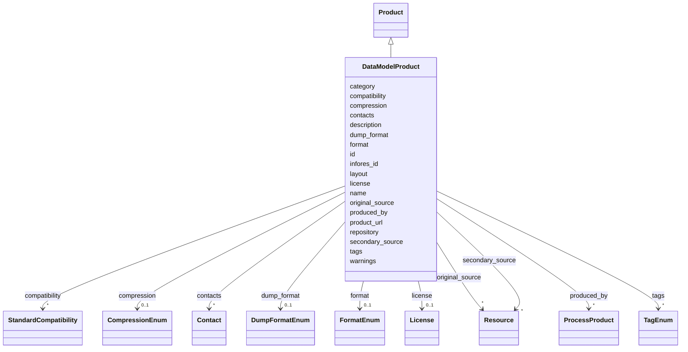

# Class: DataModelProduct


_A product that is a data model, such as an ontology or schema._


URI: [kgr:DataModelProduct](https://w3id.org/bridge2ai/data-sheets-schema/DataModelProduct)





## Inheritance
* [NamedThing](NamedThing.html)
    * [Product](Product.html)
        * **DataModelProduct**


## Slots

| Name | Cardinality and Range | Description | Inheritance |
| ---  | --- | --- | --- |
| [name](name.html) | 1 <br/> [String](String.html) | The human-readable name of the product | [Product](Product.html) |
| [description](description.html) | 0..1 <br/> [String](String.html) | A description of the product | [Product](Product.html) |
| [original_source](original_source.html) | * <br/> [Resource](Resource.html) | The original source(s) of the product, referred to  by the identifier of each... | [Product](Product.html) |
| [secondary_source](secondary_source.html) | * <br/> [Resource](Resource.html) | The source(s) of the product, other than its original source, referred to by ... | [Product](Product.html) |
| [product_url](product_url.html) | 0..1 <br/> [Uriorcurie](Uriorcurie.html) | The URL of the product | [Product](Product.html) |
| [produced_by](produced_by.html) | * <br/> [ProcessProduct](ProcessProduct.html) | The process(es) that produced the product, referred to by the identifier of e... | [Product](Product.html) |
| [repository](repository.html) | 0..1 <br/> [Uriorcurie](Uriorcurie.html) | A main version control repository for the product | [Product](Product.html) |
| [license](license.html) | 0..1 <br/> [License](License.html) | The license of the product | [Product](Product.html) |
| [compression](compression.html) | 0..1 <br/> [CompressionEnum](CompressionEnum.html) | The type of compression used with the product | [Product](Product.html) |
| [contacts](contacts.html) | * <br/> [Contact](Contact.html) | The contact points for the product | [Product](Product.html) |
| [tags](tags.html) | * <br/> [TagEnum](TagEnum.html) | Tags associated with the product | [Product](Product.html) |
| [infores_id](infores_id.html) | 0..1 <br/> [String](String.html) | The Infores ID of the product | [Product](Product.html) |
| [compatibility](compatibility.html) | * <br/> [StandardCompatibility](StandardCompatibility.html) | A list of standards that the product conforms to | [Product](Product.html) |
| [format](format.html) | 0..1 <br/> [FormatEnum](FormatEnum.html) | The format or serialization of the product | [Product](Product.html) |
| [dump_format](dump_format.html) | 0..1 <br/> [DumpFormatEnum](DumpFormatEnum.html) | The format of a dump of the product as a file | [Product](Product.html) |
| [id](id.html) | 1 <br/> [String](String.html) | The identifier of an entity | [NamedThing](NamedThing.html) |
| [category](category.html) | 0..1 <br/> [CategoryType](CategoryType.html) | The category of the entity | [NamedThing](NamedThing.html) |
| [warnings](warnings.html) | * <br/> [String](String.html) | A list of warnings about an item to be displayed in the interface | [NamedThing](NamedThing.html) |
| [layout](layout.html) | 0..1 <br/> [String](String.html) | The layout of the entity | [NamedThing](NamedThing.html) |


## Identifier and Mapping Information


### Schema Source


* from schema: https://w3id.org/knowledge-graph-hub/kg_registry_schema


## Mappings

| Mapping Type | Mapped Value |
| ---  | ---  |
| self | kgr:DataModelProduct |
| native | kgr:DataModelProduct |


## LinkML Source

<!-- TODO: investigate https://stackoverflow.com/questions/37606292/how-to-create-tabbed-code-blocks-in-mkdocs-or-sphinx -->

### Direct

<details>
```yaml
name: DataModelProduct
description: A product that is a data model, such as an ontology or schema.
from_schema: https://w3id.org/knowledge-graph-hub/kg_registry_schema
is_a: Product

```
</details>

### Induced

<details>
```yaml
name: DataModelProduct
description: A product that is a data model, such as an ontology or schema.
from_schema: https://w3id.org/knowledge-graph-hub/kg_registry_schema
is_a: Product
attributes:
  name:
    name: name
    description: The human-readable name of the product.
    from_schema: https://w3id.org/knowledge-graph-hub/kg_registry_schema
    alias: name
    owner: DataModelProduct
    domain_of:
    - Resource
    - Product
    range: string
    required: true
  description:
    name: description
    description: A description of the product.
    from_schema: https://w3id.org/knowledge-graph-hub/kg_registry_schema
    alias: description
    owner: DataModelProduct
    domain_of:
    - Resource
    - Product
    - Usage
    range: string
  original_source:
    name: original_source
    description: The original source(s) of the product, referred to  by the identifier
      of each resource. This may be the parent resource or another resource.
    from_schema: https://w3id.org/knowledge-graph-hub/kg_registry_schema
    rank: 1000
    alias: original_source
    owner: DataModelProduct
    domain_of:
    - Product
    range: Resource
    multivalued: true
  secondary_source:
    name: secondary_source
    description: The source(s) of the product, other than its original source, referred
      to by the identifier of each resource. This may be an Aggregator or another
      resource.
    from_schema: https://w3id.org/knowledge-graph-hub/kg_registry_schema
    rank: 1000
    alias: secondary_source
    owner: DataModelProduct
    domain_of:
    - Product
    range: Resource
    multivalued: true
  product_url:
    name: product_url
    description: The URL of the product. This may be a link to download a specific
      file, a base URL to an API, or a link to a graphical interface.
    from_schema: https://w3id.org/knowledge-graph-hub/kg_registry_schema
    rank: 1000
    alias: product_url
    owner: DataModelProduct
    domain_of:
    - Product
    range: uriorcurie
  produced_by:
    name: produced_by
    description: The process(es) that produced the product, referred to by the identifier
      of each process.
    from_schema: https://w3id.org/knowledge-graph-hub/kg_registry_schema
    rank: 1000
    alias: produced_by
    owner: DataModelProduct
    domain_of:
    - Product
    range: ProcessProduct
    multivalued: true
  repository:
    name: repository
    description: A main version control repository for the product.
    from_schema: https://w3id.org/knowledge-graph-hub/kg_registry_schema
    alias: repository
    owner: DataModelProduct
    domain_of:
    - Resource
    - Product
    range: uriorcurie
  license:
    name: license
    description: The license of the product. This may differ from that of the parent
      resource.
    from_schema: https://w3id.org/knowledge-graph-hub/kg_registry_schema
    alias: license
    owner: DataModelProduct
    domain_of:
    - Resource
    - Product
    range: License
    inlined: true
  compression:
    name: compression
    description: The type of compression used with the product. If this is not specified,
      it is assumed to be uncompressed.
    from_schema: https://w3id.org/knowledge-graph-hub/kg_registry_schema
    rank: 1000
    alias: compression
    owner: DataModelProduct
    domain_of:
    - Product
    range: CompressionEnum
  contacts:
    name: contacts
    description: The contact points for the product. May be an individual or organization.
    from_schema: https://w3id.org/knowledge-graph-hub/kg_registry_schema
    alias: contacts
    owner: DataModelProduct
    domain_of:
    - Resource
    - Product
    range: Contact
    multivalued: true
  tags:
    name: tags
    description: Tags associated with the product.
    from_schema: https://w3id.org/knowledge-graph-hub/kg_registry_schema
    alias: tags
    owner: DataModelProduct
    domain_of:
    - Resource
    - Product
    range: TagEnum
    multivalued: true
  infores_id:
    name: infores_id
    description: The Infores ID of the product. Do not include the 'infores' prefix.
    from_schema: https://w3id.org/knowledge-graph-hub/kg_registry_schema
    alias: infores_id
    owner: DataModelProduct
    domain_of:
    - Resource
    - Product
    range: string
  compatibility:
    name: compatibility
    description: A list of standards that the product conforms to. This is not the
      same as its serialization/format.
    from_schema: https://w3id.org/knowledge-graph-hub/kg_registry_schema
    rank: 1000
    alias: compatibility
    owner: DataModelProduct
    domain_of:
    - Product
    range: StandardCompatibility
    multivalued: true
    inlined: true
  format:
    name: format
    description: The format or serialization of the product. Generally corresponds
      to the file extension.
    from_schema: https://w3id.org/knowledge-graph-hub/kg_registry_schema
    rank: 1000
    alias: format
    owner: DataModelProduct
    domain_of:
    - Product
    range: FormatEnum
  dump_format:
    name: dump_format
    description: The format of a dump of the product as a file. Note the product may
      also be compressed.
    from_schema: https://w3id.org/knowledge-graph-hub/kg_registry_schema
    rank: 1000
    alias: dump_format
    owner: DataModelProduct
    domain_of:
    - Product
    range: DumpFormatEnum
  id:
    name: id
    description: The identifier of an entity. This is used to identify it within the
      registry.
    from_schema: https://w3id.org/knowledge-graph-hub/kg_registry_schema
    rank: 1000
    slot_uri: dcterms:identifier
    identifier: true
    alias: id
    owner: DataModelProduct
    domain_of:
    - NamedThing
    range: string
    required: true
  category:
    name: category
    description: The category of the entity. This should be identical to its class
      name.
    from_schema: https://w3id.org/knowledge-graph-hub/kg_registry_schema
    rank: 1000
    is_a: type
    domain: NamedThing
    alias: category
    owner: DataModelProduct
    domain_of:
    - NamedThing
    - Contact
    range: category_type
  warnings:
    name: warnings
    description: A list of warnings about an item to be displayed in the interface.
      These should primarily warn users about unavailable resources, broken links,
      and other obstacles to using a resource.
    from_schema: https://w3id.org/knowledge-graph-hub/kg_registry_schema
    rank: 1000
    alias: warnings
    owner: DataModelProduct
    domain_of:
    - NamedThing
    range: string
    multivalued: true
    inlined: true
    inlined_as_list: true
  layout:
    name: layout
    description: The layout of the entity. This is used to determine how to display
      the entity in the web interface. For resources, this is generally 'resource_detail'.
      For products, this is generally 'product_detail'.
    from_schema: https://w3id.org/knowledge-graph-hub/kg_registry_schema
    rank: 1000
    alias: layout
    owner: DataModelProduct
    domain_of:
    - NamedThing
    range: string

```
</details>
