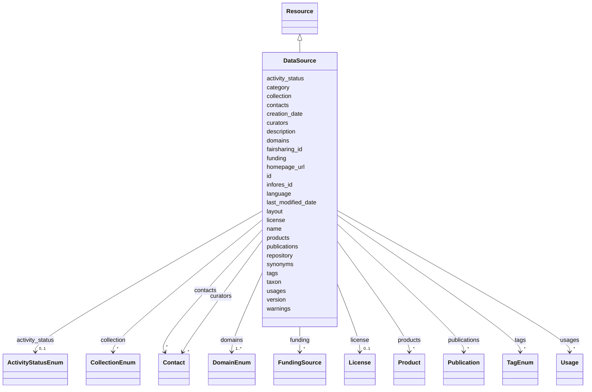

# Class: DataSource


_A data source. One data source may have multiple products._


URI: [kgr:DataSource](https://w3id.org/bridge2ai/data-sheets-schema/DataSource)





## Inheritance
* [NamedThing](NamedThing.html)
    * [Resource](Resource.html)
        * **DataSource**


## Slots

| Name | Cardinality and Range | Description | Inheritance |
| ---  | --- | --- | --- |
| [activity_status](activity_status.html) | 0..1 <br/> [ActivityStatusEnum](ActivityStatusEnum.html) | The status of the resource | [Resource](Resource.html) |
| [name](name.html) | 1 <br/> [String](String.html) | The human-readable name of the resource | [Resource](Resource.html) |
| [description](description.html) | 0..1 <br/> [String](String.html) | A description of the resource | [Resource](Resource.html) |
| [homepage_url](homepage_url.html) | 0..1 <br/> [Uriorcurie](Uriorcurie.html) | The primary URL of the resource | [Resource](Resource.html) |
| [repository](repository.html) | 0..1 <br/> [Uriorcurie](Uriorcurie.html) | A main version control repository for the resource | [Resource](Resource.html) |
| [license](license_slot.html) | 0..1 <br/> [License](License.html) | The license of the resource | [Resource](Resource.html) |
| [version](version.html) | 0..1 <br/> [String](String.html) | The version of the resource | [Resource](Resource.html) |
| [language](language.html) | 0..1 <br/> [String](String.html) | The human language of the resource | [Resource](Resource.html) |
| [contacts](contacts.html) | * <br/> [Contact](Contact.html) | The contact point(s) for the resource | [Resource](Resource.html) |
| [curators](curators.html) | * <br/> [Contact](Contact.html) | The curator(s) of the resource | [Resource](Resource.html) |
| [products](products.html) | * <br/> [Product](Product.html) | The products or representations of the resource | [Resource](Resource.html) |
| [domains](domains.html) | 1..* <br/> [DomainEnum](DomainEnum.html) | The domain(s) that the resource is relevant to | [Resource](Resource.html) |
| [tags](tags.html) | * <br/> [TagEnum](TagEnum.html) | Tags associated with the resource | [Resource](Resource.html) |
| [funding](funding.html) | * <br/> [FundingSource](FundingSource.html) | The funding source(s) for the resource | [Resource](Resource.html) |
| [publications](publications.html) | * <br/> [Publication](Publication.html) | Publications associated with the resource | [Resource](Resource.html) |
| [usages](usages.html) | * <br/> [Usage](Usage.html) | The usage(s) of the resource | [Resource](Resource.html) |
| [fairsharing_id](fairsharing_id.html) | 0..1 <br/> [String](String.html) | The FAIRsharing ID of the resource | [Resource](Resource.html) |
| [infores_id](infores_id.html) | 0..1 <br/> [String](String.html) | The Infores ID of the resource | [Resource](Resource.html) |
| [taxon](taxon.html) | * <br/> [Uriorcurie](Uriorcurie.html) | The taxon or taxa that the resource is relevant to | [Resource](Resource.html) |
| [synonyms](synonyms.html) | * <br/> [String](String.html) | A list of synonyms for the resource | [Resource](Resource.html) |
| [id](id.html) | 1 <br/> [String](String.html) | The identifier of an entity | [NamedThing](NamedThing.html) |
| [category](category.html) | 0..1 <br/> [CategoryType](CategoryType.html) | The category of the entity | [NamedThing](NamedThing.html) |
| [warnings](warnings.html) | * <br/> [String](String.html) | A list of warnings about an item to be displayed in the interface | [NamedThing](NamedThing.html) |
| [collection](collection.html) | * <br/> [CollectionEnum](CollectionEnum.html) | A collection of entries in the registry | [NamedThing](NamedThing.html) |
| [layout](layout.html) | 1 <br/> [String](String.html) | The layout of the entity | [NamedThing](NamedThing.html) |
| [creation_date](creation_date.html) | 0..1 <br/> [Datetime](Datetime.html) | The date the entry was created | [NamedThing](NamedThing.html) |
| [last_modified_date](last_modified_date.html) | 0..1 <br/> [Datetime](Datetime.html) | The date the entry was last modified | [NamedThing](NamedThing.html) |


## Identifier and Mapping Information


### Schema Source


* from schema: https://w3id.org/knowledge-graph-hub/kg_registry_schema


## Mappings

| Mapping Type | Mapped Value |
| ---  | ---  |
| self | kgr:DataSource |
| native | kgr:DataSource |


## LinkML Source

<!-- TODO: investigate https://stackoverflow.com/questions/37606292/how-to-create-tabbed-code-blocks-in-mkdocs-or-sphinx -->

### Direct

<details>
```yaml
name: DataSource
description: A data source. One data source may have multiple products.
from_schema: https://w3id.org/knowledge-graph-hub/kg_registry_schema
is_a: Resource

```
</details>

### Induced

<details>
```yaml
name: DataSource
description: A data source. One data source may have multiple products.
from_schema: https://w3id.org/knowledge-graph-hub/kg_registry_schema
is_a: Resource
attributes:
  activity_status:
    name: activity_status
    description: The status of the resource.
    from_schema: https://w3id.org/knowledge-graph-hub/kg_registry_schema
    rank: 1000
    alias: activity_status
    owner: DataSource
    domain_of:
    - Resource
    range: ActivityStatusEnum
  name:
    name: name
    description: The human-readable name of the resource.
    from_schema: https://w3id.org/knowledge-graph-hub/kg_registry_schema
    rank: 1000
    alias: name
    owner: DataSource
    domain_of:
    - Resource
    - Product
    range: string
    required: true
  description:
    name: description
    description: A description of the resource.
    from_schema: https://w3id.org/knowledge-graph-hub/kg_registry_schema
    rank: 1000
    alias: description
    owner: DataSource
    domain_of:
    - Resource
    - Product
    - Organization
    - Usage
    range: string
  homepage_url:
    name: homepage_url
    description: The primary URL of the resource. This may be a link to download a
      specific file, a base URL to an API, or a link to a graphical interface, but
      it should preferentially be the main page documenting the resource.
    from_schema: https://w3id.org/knowledge-graph-hub/kg_registry_schema
    rank: 1000
    alias: homepage_url
    owner: DataSource
    domain_of:
    - Resource
    - Organization
    range: uriorcurie
  repository:
    name: repository
    description: A main version control repository for the resource. Specific products
      may have their own repositories.
    from_schema: https://w3id.org/knowledge-graph-hub/kg_registry_schema
    rank: 1000
    alias: repository
    owner: DataSource
    domain_of:
    - Resource
    - Product
    range: uriorcurie
  license:
    name: license
    description: The license of the resource. Individual products may have their own
      licenses.
    from_schema: https://w3id.org/knowledge-graph-hub/kg_registry_schema
    rank: 1000
    alias: license
    owner: DataSource
    domain_of:
    - Resource
    - Product
    range: License
    inlined: true
  version:
    name: version
    description: The version of the resource.
    from_schema: https://w3id.org/knowledge-graph-hub/kg_registry_schema
    exact_mappings:
    - schema:version
    - dcterms:hasVersion
    rank: 1000
    alias: version
    owner: DataSource
    domain_of:
    - Resource
    - StandardCompatibility
    range: string
  language:
    name: language
    description: The human language of the resource.
    from_schema: https://w3id.org/knowledge-graph-hub/kg_registry_schema
    rank: 1000
    alias: language
    owner: DataSource
    domain_of:
    - Resource
    range: string
  contacts:
    name: contacts
    description: The contact point(s) for the resource. May be an individual or organization.
    from_schema: https://w3id.org/knowledge-graph-hub/kg_registry_schema
    rank: 1000
    alias: contacts
    owner: DataSource
    domain_of:
    - Resource
    - Product
    range: Contact
    multivalued: true
    inlined: true
    inlined_as_list: true
  curators:
    name: curators
    description: The curator(s) of the resource. May be an individual or organization.
    from_schema: https://w3id.org/knowledge-graph-hub/kg_registry_schema
    rank: 1000
    alias: curators
    owner: DataSource
    domain_of:
    - Resource
    - Product
    range: Contact
    multivalued: true
    inlined: true
    inlined_as_list: true
  products:
    name: products
    description: The products or representations of the resource.
    from_schema: https://w3id.org/knowledge-graph-hub/kg_registry_schema
    rank: 1000
    alias: products
    owner: DataSource
    domain_of:
    - Resource
    range: Product
    multivalued: true
    inlined: true
    inlined_as_list: true
  domains:
    name: domains
    description: The domain(s) that the resource is relevant to.
    from_schema: https://w3id.org/knowledge-graph-hub/kg_registry_schema
    rank: 1000
    alias: domains
    owner: DataSource
    domain_of:
    - Resource
    range: DomainEnum
    required: true
    multivalued: true
  tags:
    name: tags
    description: Tags associated with the resource.
    from_schema: https://w3id.org/knowledge-graph-hub/kg_registry_schema
    rank: 1000
    alias: tags
    owner: DataSource
    domain_of:
    - Resource
    - Product
    range: TagEnum
    multivalued: true
  funding:
    name: funding
    description: The funding source(s) for the resource.
    from_schema: https://w3id.org/knowledge-graph-hub/kg_registry_schema
    rank: 1000
    alias: funding
    owner: DataSource
    domain_of:
    - Resource
    range: FundingSource
    multivalued: true
  publications:
    name: publications
    description: Publications associated with the resource.
    from_schema: https://w3id.org/knowledge-graph-hub/kg_registry_schema
    rank: 1000
    alias: publications
    owner: DataSource
    domain_of:
    - Resource
    - Usage
    range: Publication
    multivalued: true
    inlined: true
    inlined_as_list: true
  usages:
    name: usages
    description: The usage(s) of the resource.
    from_schema: https://w3id.org/knowledge-graph-hub/kg_registry_schema
    rank: 1000
    alias: usages
    owner: DataSource
    domain_of:
    - Resource
    range: Usage
    multivalued: true
    inlined: true
    inlined_as_list: true
  fairsharing_id:
    name: fairsharing_id
    description: The FAIRsharing ID of the resource.
    from_schema: https://w3id.org/knowledge-graph-hub/kg_registry_schema
    rank: 1000
    alias: fairsharing_id
    owner: DataSource
    domain_of:
    - Resource
    range: string
  infores_id:
    name: infores_id
    description: The Infores ID of the resource. Do not include the 'infores' prefix.
    from_schema: https://w3id.org/knowledge-graph-hub/kg_registry_schema
    rank: 1000
    alias: infores_id
    owner: DataSource
    domain_of:
    - Resource
    - Product
    range: string
  taxon:
    name: taxon
    description: The taxon or taxa that the resource is relevant to. This is preferably
      an NCBI Taxonomy identifier, in CURIE format.
    from_schema: https://w3id.org/knowledge-graph-hub/kg_registry_schema
    rank: 1000
    alias: taxon
    owner: DataSource
    domain_of:
    - Resource
    range: uriorcurie
    multivalued: true
  synonyms:
    name: synonyms
    description: A list of synonyms for the resource. These may include acronyms,
      abbreviations, or other alternate names for the resource. They are not necessarily
      unique across resources.
    from_schema: https://w3id.org/knowledge-graph-hub/kg_registry_schema
    rank: 1000
    alias: synonyms
    owner: DataSource
    domain_of:
    - Resource
    range: string
    multivalued: true
  id:
    name: id
    description: The identifier of an entity. This is used to identify it within the
      registry.
    from_schema: https://w3id.org/knowledge-graph-hub/kg_registry_schema
    rank: 1000
    slot_uri: dcterms:identifier
    identifier: true
    alias: id
    owner: DataSource
    domain_of:
    - NamedThing
    - Organization
    range: string
    required: true
  category:
    name: category
    description: The category of the entity. This should be identical to its class
      name.
    from_schema: https://w3id.org/knowledge-graph-hub/kg_registry_schema
    rank: 1000
    is_a: type
    domain: NamedThing
    alias: category
    owner: DataSource
    domain_of:
    - NamedThing
    - Contact
    range: category_type
  warnings:
    name: warnings
    description: A list of warnings about an item to be displayed in the interface.
      These should primarily warn users about unavailable resources, broken links,
      and other obstacles to using a resource.
    from_schema: https://w3id.org/knowledge-graph-hub/kg_registry_schema
    rank: 1000
    alias: warnings
    owner: DataSource
    domain_of:
    - NamedThing
    range: string
    multivalued: true
    inlined: true
    inlined_as_list: true
  collection:
    name: collection
    description: A collection of entries in the registry. This is used to group related
      entries together. This is multivalued to allow for multiple collections.
    from_schema: https://w3id.org/knowledge-graph-hub/kg_registry_schema
    rank: 1000
    alias: collection
    owner: DataSource
    domain_of:
    - NamedThing
    range: CollectionEnum
    multivalued: true
  layout:
    name: layout
    description: The layout of the entity. This is used to determine how to display
      the entity in the web interface. For resources, this is generally 'resource_detail'.
      For products, this is generally 'product_detail'. If a value for this slot is
      not specified, pages won't contain anything from their header metadata.
    from_schema: https://w3id.org/knowledge-graph-hub/kg_registry_schema
    rank: 1000
    alias: layout
    owner: DataSource
    domain_of:
    - NamedThing
    - Organization
    range: string
    required: true
  creation_date:
    name: creation_date
    description: The date the entry was created. This is used to determine the age
      of the entity. It should be in ISO 8601 format, e.g., 2024-02-12T00:00:00Z.
    from_schema: https://w3id.org/knowledge-graph-hub/kg_registry_schema
    rank: 1000
    alias: creation_date
    owner: DataSource
    domain_of:
    - NamedThing
    - Organization
    range: datetime
  last_modified_date:
    name: last_modified_date
    description: The date the entry was last modified. It should be in ISO 8601 format,
      e.g., 2024-02-12T00:00:00Z.
    from_schema: https://w3id.org/knowledge-graph-hub/kg_registry_schema
    rank: 1000
    alias: last_modified_date
    owner: DataSource
    domain_of:
    - NamedThing
    - Organization
    range: datetime

```
</details>
