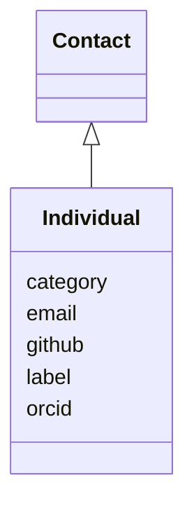

# Class: Individual


_An individual person._


URI: [kgr:Individual](https://w3id.org/bridge2ai/data-sheets-schema/Individual)





## Inheritance
* [Contact](Contact.html)
    * **Individual**


## Slots

| Name | Cardinality and Range | Description | Inheritance |
| ---  | --- | --- | --- |
| [label](label.html) | 0..1 <br/> [String](String.html) | The name of the individual | direct |
| [email](email.html) | 0..1 <br/> [String](String.html) | The email address of the individual | direct |
| [github](github.html) | 0..1 <br/> [String](String.html) | The GitHub username of the individual | direct |
| [orcid](orcid.html) | 0..1 <br/> [String](String.html) | The ORCID of the individual | direct |
| [category](category.html) | 0..1 <br/> [CategoryType](CategoryType.html) | The category of the entity | [Contact](Contact.html) |


## Identifier and Mapping Information


### Schema Source


* from schema: https://w3id.org/knowledge-graph-hub/kg_registry_schema


## Mappings

| Mapping Type | Mapped Value |
| ---  | ---  |
| self | kgr:Individual |
| native | kgr:Individual |


## LinkML Source

<!-- TODO: investigate https://stackoverflow.com/questions/37606292/how-to-create-tabbed-code-blocks-in-mkdocs-or-sphinx -->

### Direct

<details>
```yaml
name: Individual
description: An individual person.
from_schema: https://w3id.org/knowledge-graph-hub/kg_registry_schema
is_a: Contact
attributes:
  label:
    name: label
    description: The name of the individual.
    from_schema: https://w3id.org/knowledge-graph-hub/kg_registry_schema
    rank: 1000
    domain_of:
    - Individual
    - Organization
    - FundingSource
    - License
    - Usage
    range: string
  email:
    name: email
    description: The email address of the individual.
    from_schema: https://w3id.org/knowledge-graph-hub/kg_registry_schema
    rank: 1000
    domain_of:
    - Individual
    - Organization
    range: string
  github:
    name: github
    description: The GitHub username of the individual. Do not include a prefix.
    from_schema: https://w3id.org/knowledge-graph-hub/kg_registry_schema
    rank: 1000
    domain_of:
    - Individual
    - Organization
    range: string
  orcid:
    name: orcid
    description: The ORCID of the individual. Do not include the "https://orcid.org/"
      prefix.
    from_schema: https://w3id.org/knowledge-graph-hub/kg_registry_schema
    rank: 1000
    domain_of:
    - Individual
    range: string
    pattern: ^\d{4}-\d{4}-\d{4}-\d{3}(\d|X)$

```
</details>

### Induced

<details>
```yaml
name: Individual
description: An individual person.
from_schema: https://w3id.org/knowledge-graph-hub/kg_registry_schema
is_a: Contact
attributes:
  label:
    name: label
    description: The name of the individual.
    from_schema: https://w3id.org/knowledge-graph-hub/kg_registry_schema
    rank: 1000
    alias: label
    owner: Individual
    domain_of:
    - Individual
    - Organization
    - FundingSource
    - License
    - Usage
    range: string
  email:
    name: email
    description: The email address of the individual.
    from_schema: https://w3id.org/knowledge-graph-hub/kg_registry_schema
    rank: 1000
    alias: email
    owner: Individual
    domain_of:
    - Individual
    - Organization
    range: string
  github:
    name: github
    description: The GitHub username of the individual. Do not include a prefix.
    from_schema: https://w3id.org/knowledge-graph-hub/kg_registry_schema
    rank: 1000
    alias: github
    owner: Individual
    domain_of:
    - Individual
    - Organization
    range: string
  orcid:
    name: orcid
    description: The ORCID of the individual. Do not include the "https://orcid.org/"
      prefix.
    from_schema: https://w3id.org/knowledge-graph-hub/kg_registry_schema
    rank: 1000
    alias: orcid
    owner: Individual
    domain_of:
    - Individual
    range: string
    pattern: ^\d{4}-\d{4}-\d{4}-\d{3}(\d|X)$
  category:
    name: category
    description: The category of the entity. This should be identical to its class
      name.
    from_schema: https://w3id.org/knowledge-graph-hub/kg_registry_schema
    rank: 1000
    is_a: type
    domain: NamedThing
    alias: category
    owner: Individual
    domain_of:
    - NamedThing
    - Contact
    range: category_type

```
</details>
