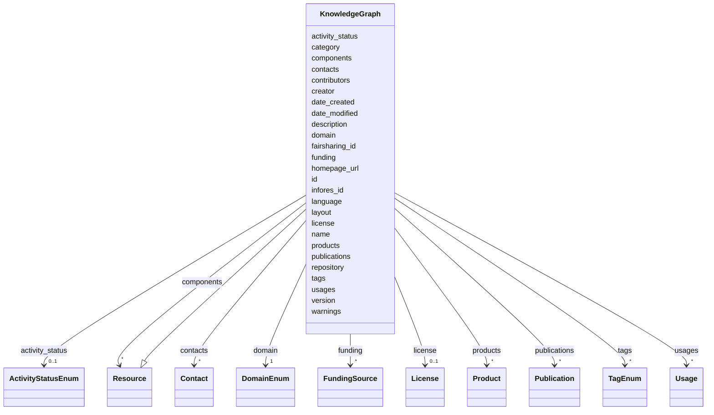

# Class: KnowledgeGraph


_A knowledge graph resource. This is any heterogeneous collection of data that is represented as nodes (entities) and edges (relationships) between them. The nodes and edges may have attributes associated with them. This is not identical to the graph *product*, as a single KnowledgeGraph may have multiple products or representations._


URI: [kgr:KnowledgeGraph](https://w3id.org/bridge2ai/data-sheets-schema/KnowledgeGraph)





## Inheritance
* [NamedThing](NamedThing.html)
    * [Resource](Resource.html)
        * **KnowledgeGraph**


## Slots

| Name | Cardinality and Range | Description | Inheritance |
| ---  | --- | --- | --- |
| [creator](creator.html) | 0..1 <br/> [String](String.html) | The person or organization responsible for creating the knowledge graph | direct |
| [date_created](date_created.html) | 0..1 <br/> [String](String.html) | The date the knowledge graph was created | direct |
| [date_modified](date_modified.html) | 0..1 <br/> [String](String.html) | The date the knowledge graph was last modified | direct |
| [contributors](contributors.html) | 0..1 <br/> [String](String.html) | Contributors to the knowledge graph | direct |
| [components](components.html) | * <br/> [Resource](Resource.html) | The components of the knowledge graph | direct |
| [activity_status](activity_status.html) | 0..1 <br/> [ActivityStatusEnum](ActivityStatusEnum.html) | The status of the resource | [Resource](Resource.html) |
| [name](name.html) | 1 <br/> [String](String.html) | The human-readable name of the resource | [Resource](Resource.html) |
| [description](description.html) | 0..1 <br/> [String](String.html) | A description of the resource | [Resource](Resource.html) |
| [homepage_url](homepage_url.html) | 0..1 <br/> [Uriorcurie](Uriorcurie.html) | The primary URL of the resource | [Resource](Resource.html) |
| [repository](repository.html) | 0..1 <br/> [Uriorcurie](Uriorcurie.html) | A main version control repository for the resource | [Resource](Resource.html) |
| [license](license.html) | 0..1 <br/> [License](License.html) | The license of the resource | [Resource](Resource.html) |
| [version](version.html) | 0..1 <br/> [String](String.html) | The version of the resource | [Resource](Resource.html) |
| [language](language.html) | 0..1 <br/> [String](String.html) | The human language of the resource | [Resource](Resource.html) |
| [contacts](contacts.html) | * <br/> [Contact](Contact.html) | The contact point(s) for the resource | [Resource](Resource.html) |
| [products](products.html) | * <br/> [Product](Product.html) | The products or representations of the resource | [Resource](Resource.html) |
| [domain](domain.html) | 1 <br/> [DomainEnum](DomainEnum.html) | The domain that the resource is relevant to | [Resource](Resource.html) |
| [tags](tags.html) | * <br/> [TagEnum](TagEnum.html) | Tags associated with the resource | [Resource](Resource.html) |
| [funding](funding.html) | * <br/> [FundingSource](FundingSource.html) | The funding source(s) for the resource | [Resource](Resource.html) |
| [publications](publications.html) | * <br/> [Publication](Publication.html) | Publications associated with the resource | [Resource](Resource.html) |
| [usages](usages.html) | * <br/> [Usage](Usage.html) | The usage(s) of the resource | [Resource](Resource.html) |
| [fairsharing_id](fairsharing_id.html) | 0..1 <br/> [String](String.html) | The FAIRsharing ID of the resource | [Resource](Resource.html) |
| [infores_id](infores_id.html) | 0..1 <br/> [String](String.html) | The Infores ID of the resource | [Resource](Resource.html) |
| [id](id.html) | 1 <br/> [String](String.html) | The identifier of an entity | [NamedThing](NamedThing.html) |
| [category](category.html) | 0..1 <br/> [CategoryType](CategoryType.html) | The category of the entity | [NamedThing](NamedThing.html) |
| [warnings](warnings.html) | * <br/> [String](String.html) | A list of warnings about an item to be displayed in the interface | [NamedThing](NamedThing.html) |
| [layout](layout.html) | 0..1 <br/> [String](String.html) | The layout of the entity | [NamedThing](NamedThing.html) |


## Aliases


* kg
* heterogeneous graph


## Identifier and Mapping Information


### Schema Source


* from schema: https://w3id.org/knowledge-graph-hub/kg_registry_schema


## Mappings

| Mapping Type | Mapped Value |
| ---  | ---  |
| self | kgr:KnowledgeGraph |
| native | kgr:KnowledgeGraph |


## LinkML Source

<!-- TODO: investigate https://stackoverflow.com/questions/37606292/how-to-create-tabbed-code-blocks-in-mkdocs-or-sphinx -->

### Direct

<details>
```yaml
name: KnowledgeGraph
description: A knowledge graph resource. This is any heterogeneous collection of data
  that is represented as nodes (entities) and edges (relationships) between them.
  The nodes and edges may have attributes associated with them. This is not identical
  to the graph *product*, as a single KnowledgeGraph may have multiple products or
  representations.
from_schema: https://w3id.org/knowledge-graph-hub/kg_registry_schema
aliases:
- kg
- heterogeneous graph
is_a: Resource
attributes:
  creator:
    name: creator
    description: The person or organization responsible for creating the knowledge
      graph.
    from_schema: https://w3id.org/knowledge-graph-hub/kg_registry_schema
    rank: 1000
    domain_of:
    - KnowledgeGraph
    range: string
  date_created:
    name: date_created
    description: The date the knowledge graph was created.
    from_schema: https://w3id.org/knowledge-graph-hub/kg_registry_schema
    rank: 1000
    domain_of:
    - KnowledgeGraph
    range: string
  date_modified:
    name: date_modified
    description: The date the knowledge graph was last modified.
    from_schema: https://w3id.org/knowledge-graph-hub/kg_registry_schema
    rank: 1000
    domain_of:
    - KnowledgeGraph
    range: string
  contributors:
    name: contributors
    description: Contributors to the knowledge graph.
    from_schema: https://w3id.org/knowledge-graph-hub/kg_registry_schema
    rank: 1000
    domain_of:
    - KnowledgeGraph
    range: string
  components:
    name: components
    description: The components of the knowledge graph.
    from_schema: https://w3id.org/knowledge-graph-hub/kg_registry_schema
    rank: 1000
    domain_of:
    - KnowledgeGraph
    range: Resource
    multivalued: true

```
</details>

### Induced

<details>
```yaml
name: KnowledgeGraph
description: A knowledge graph resource. This is any heterogeneous collection of data
  that is represented as nodes (entities) and edges (relationships) between them.
  The nodes and edges may have attributes associated with them. This is not identical
  to the graph *product*, as a single KnowledgeGraph may have multiple products or
  representations.
from_schema: https://w3id.org/knowledge-graph-hub/kg_registry_schema
aliases:
- kg
- heterogeneous graph
is_a: Resource
attributes:
  creator:
    name: creator
    description: The person or organization responsible for creating the knowledge
      graph.
    from_schema: https://w3id.org/knowledge-graph-hub/kg_registry_schema
    rank: 1000
    alias: creator
    owner: KnowledgeGraph
    domain_of:
    - KnowledgeGraph
    range: string
  date_created:
    name: date_created
    description: The date the knowledge graph was created.
    from_schema: https://w3id.org/knowledge-graph-hub/kg_registry_schema
    rank: 1000
    alias: date_created
    owner: KnowledgeGraph
    domain_of:
    - KnowledgeGraph
    range: string
  date_modified:
    name: date_modified
    description: The date the knowledge graph was last modified.
    from_schema: https://w3id.org/knowledge-graph-hub/kg_registry_schema
    rank: 1000
    alias: date_modified
    owner: KnowledgeGraph
    domain_of:
    - KnowledgeGraph
    range: string
  contributors:
    name: contributors
    description: Contributors to the knowledge graph.
    from_schema: https://w3id.org/knowledge-graph-hub/kg_registry_schema
    rank: 1000
    alias: contributors
    owner: KnowledgeGraph
    domain_of:
    - KnowledgeGraph
    range: string
  components:
    name: components
    description: The components of the knowledge graph.
    from_schema: https://w3id.org/knowledge-graph-hub/kg_registry_schema
    rank: 1000
    alias: components
    owner: KnowledgeGraph
    domain_of:
    - KnowledgeGraph
    range: Resource
    multivalued: true
  activity_status:
    name: activity_status
    description: The status of the resource.
    from_schema: https://w3id.org/knowledge-graph-hub/kg_registry_schema
    rank: 1000
    alias: activity_status
    owner: KnowledgeGraph
    domain_of:
    - Resource
    range: ActivityStatusEnum
  name:
    name: name
    description: The human-readable name of the resource.
    from_schema: https://w3id.org/knowledge-graph-hub/kg_registry_schema
    rank: 1000
    alias: name
    owner: KnowledgeGraph
    domain_of:
    - Resource
    - Product
    range: string
    required: true
  description:
    name: description
    description: A description of the resource.
    from_schema: https://w3id.org/knowledge-graph-hub/kg_registry_schema
    rank: 1000
    alias: description
    owner: KnowledgeGraph
    domain_of:
    - Resource
    - Product
    - Usage
    range: string
  homepage_url:
    name: homepage_url
    description: The primary URL of the resource. This may be a link to download a
      specific file, a base URL to an API, or a link to a graphical interface, but
      it should preferentially be the main page documenting the resource.
    from_schema: https://w3id.org/knowledge-graph-hub/kg_registry_schema
    rank: 1000
    alias: homepage_url
    owner: KnowledgeGraph
    domain_of:
    - Resource
    range: uriorcurie
  repository:
    name: repository
    description: A main version control repository for the resource. Specific products
      may have their own repositories.
    from_schema: https://w3id.org/knowledge-graph-hub/kg_registry_schema
    rank: 1000
    alias: repository
    owner: KnowledgeGraph
    domain_of:
    - Resource
    - Product
    range: uriorcurie
  license:
    name: license
    description: The license of the resource. Individual products may have their own
      licenses.
    from_schema: https://w3id.org/knowledge-graph-hub/kg_registry_schema
    rank: 1000
    alias: license
    owner: KnowledgeGraph
    domain_of:
    - Resource
    - Product
    range: License
    inlined: true
  version:
    name: version
    description: The version of the resource.
    from_schema: https://w3id.org/knowledge-graph-hub/kg_registry_schema
    exact_mappings:
    - schema:version
    - dcterms:hasVersion
    rank: 1000
    alias: version
    owner: KnowledgeGraph
    domain_of:
    - Resource
    - StandardCompatibility
    range: string
  language:
    name: language
    description: The human language of the resource.
    from_schema: https://w3id.org/knowledge-graph-hub/kg_registry_schema
    rank: 1000
    alias: language
    owner: KnowledgeGraph
    domain_of:
    - Resource
    range: string
  contacts:
    name: contacts
    description: The contact point(s) for the resource. May be an individual or organization.
    from_schema: https://w3id.org/knowledge-graph-hub/kg_registry_schema
    rank: 1000
    alias: contacts
    owner: KnowledgeGraph
    domain_of:
    - Resource
    - Product
    range: Contact
    multivalued: true
    inlined: true
    inlined_as_list: true
  products:
    name: products
    description: The products or representations of the resource.
    from_schema: https://w3id.org/knowledge-graph-hub/kg_registry_schema
    rank: 1000
    alias: products
    owner: KnowledgeGraph
    domain_of:
    - Resource
    range: Product
    multivalued: true
    inlined: true
    inlined_as_list: true
  domain:
    name: domain
    description: The domain that the resource is relevant to. This is not multivalued.
    from_schema: https://w3id.org/knowledge-graph-hub/kg_registry_schema
    rank: 1000
    alias: domain
    owner: KnowledgeGraph
    domain_of:
    - Resource
    range: DomainEnum
    required: true
  tags:
    name: tags
    description: Tags associated with the resource.
    from_schema: https://w3id.org/knowledge-graph-hub/kg_registry_schema
    rank: 1000
    alias: tags
    owner: KnowledgeGraph
    domain_of:
    - Resource
    - Product
    range: TagEnum
    multivalued: true
  funding:
    name: funding
    description: The funding source(s) for the resource.
    from_schema: https://w3id.org/knowledge-graph-hub/kg_registry_schema
    rank: 1000
    alias: funding
    owner: KnowledgeGraph
    domain_of:
    - Resource
    range: FundingSource
    multivalued: true
  publications:
    name: publications
    description: Publications associated with the resource.
    from_schema: https://w3id.org/knowledge-graph-hub/kg_registry_schema
    rank: 1000
    alias: publications
    owner: KnowledgeGraph
    domain_of:
    - Resource
    - Usage
    range: Publication
    multivalued: true
    inlined: true
    inlined_as_list: true
  usages:
    name: usages
    description: The usage(s) of the resource.
    from_schema: https://w3id.org/knowledge-graph-hub/kg_registry_schema
    rank: 1000
    alias: usages
    owner: KnowledgeGraph
    domain_of:
    - Resource
    range: Usage
    multivalued: true
    inlined: true
    inlined_as_list: true
  fairsharing_id:
    name: fairsharing_id
    description: The FAIRsharing ID of the resource.
    from_schema: https://w3id.org/knowledge-graph-hub/kg_registry_schema
    rank: 1000
    alias: fairsharing_id
    owner: KnowledgeGraph
    domain_of:
    - Resource
    range: string
  infores_id:
    name: infores_id
    description: The Infores ID of the resource. Do not include the 'infores' prefix.
    from_schema: https://w3id.org/knowledge-graph-hub/kg_registry_schema
    rank: 1000
    alias: infores_id
    owner: KnowledgeGraph
    domain_of:
    - Resource
    - Product
    range: string
  id:
    name: id
    description: The identifier of an entity. This is used to identify it within the
      registry.
    from_schema: https://w3id.org/knowledge-graph-hub/kg_registry_schema
    rank: 1000
    slot_uri: dcterms:identifier
    identifier: true
    alias: id
    owner: KnowledgeGraph
    domain_of:
    - NamedThing
    range: string
    required: true
  category:
    name: category
    description: The category of the entity. This should be identical to its class
      name.
    from_schema: https://w3id.org/knowledge-graph-hub/kg_registry_schema
    rank: 1000
    is_a: type
    domain: NamedThing
    alias: category
    owner: KnowledgeGraph
    domain_of:
    - NamedThing
    - Contact
    range: category_type
  warnings:
    name: warnings
    description: A list of warnings about an item to be displayed in the interface.
      These should primarily warn users about unavailable resources, broken links,
      and other obstacles to using a resource.
    from_schema: https://w3id.org/knowledge-graph-hub/kg_registry_schema
    rank: 1000
    alias: warnings
    owner: KnowledgeGraph
    domain_of:
    - NamedThing
    range: string
    multivalued: true
    inlined: true
    inlined_as_list: true
  layout:
    name: layout
    description: The layout of the entity. This is used to determine how to display
      the entity in the web interface. For resources, this is generally 'resource_detail'.
      For products, this is generally 'product_detail'.
    from_schema: https://w3id.org/knowledge-graph-hub/kg_registry_schema
    rank: 1000
    alias: layout
    owner: KnowledgeGraph
    domain_of:
    - NamedThing
    range: string

```
</details>
