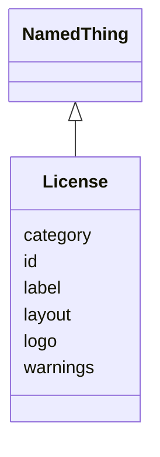

# Class: License


_A license for a resource or product. The id field should be a URL to the license text, e.g., https://creativecommons.org/licenses/by/4.0/_


URI: [kgr:License](https://w3id.org/bridge2ai/data-sheets-schema/License)





## Inheritance
* [NamedThing](NamedThing.html)
    * **License**


## Slots

| Name | Cardinality and Range | Description | Inheritance |
| ---  | --- | --- | --- |
| [label](label.html) | 0..1 <br/> [String](String.html) | The name of the license | direct |
| [logo](logo.html) | 0..1 <br/> [Uriorcurie](Uriorcurie.html) | The URL of a logo for the license | direct |
| [id](id.html) | 1 <br/> [String](String.html) | The identifier of an entity | [NamedThing](NamedThing.html) |
| [category](category.html) | 0..1 <br/> [CategoryType](CategoryType.html) | The category of the entity | [NamedThing](NamedThing.html) |
| [warnings](warnings.html) | * <br/> [String](String.html) | A list of warnings about an item to be displayed in the interface | [NamedThing](NamedThing.html) |
| [layout](layout.html) | 0..1 <br/> [String](String.html) | The layout of the entity | [NamedThing](NamedThing.html) |


## Usages

| used by | used in | type | used |
| ---  | --- | --- | --- |
| [Resource](Resource.html) | [license](license.html) | range | [License](License.html) |
| [KnowledgeGraph](KnowledgeGraph.html) | [license](license.html) | range | [License](License.html) |
| [DataSource](DataSource.html) | [license](license.html) | range | [License](License.html) |
| [DataModel](DataModel.html) | [license](license.html) | range | [License](License.html) |
| [Aggregator](Aggregator.html) | [license](license.html) | range | [License](License.html) |
| [Product](Product.html) | [license](license.html) | range | [License](License.html) |
| [GraphProduct](GraphProduct.html) | [license](license.html) | range | [License](License.html) |
| [DataModelProduct](DataModelProduct.html) | [license](license.html) | range | [License](License.html) |
| [MappingProduct](MappingProduct.html) | [license](license.html) | range | [License](License.html) |
| [ProcessProduct](ProcessProduct.html) | [license](license.html) | range | [License](License.html) |
| [GraphicalInterface](GraphicalInterface.html) | [license](license.html) | range | [License](License.html) |
| [ProgrammingInterface](ProgrammingInterface.html) | [license](license.html) | range | [License](License.html) |


## Identifier and Mapping Information


### Schema Source


* from schema: https://w3id.org/knowledge-graph-hub/kg_registry_schema


## Mappings

| Mapping Type | Mapped Value |
| ---  | ---  |
| self | kgr:License |
| native | kgr:License |


## LinkML Source

<!-- TODO: investigate https://stackoverflow.com/questions/37606292/how-to-create-tabbed-code-blocks-in-mkdocs-or-sphinx -->

### Direct

<details>
```yaml
name: License
description: A license for a resource or product. The id field should be a URL to
  the license text, e.g., https://creativecommons.org/licenses/by/4.0/
from_schema: https://w3id.org/knowledge-graph-hub/kg_registry_schema
is_a: NamedThing
attributes:
  label:
    name: label
    description: The name of the license.
    from_schema: https://w3id.org/knowledge-graph-hub/kg_registry_schema
    domain_of:
    - Individual
    - Organization
    - FundingSource
    - License
    - Usage
    range: string
  logo:
    name: logo
    description: The URL of a logo for the license. This is added at metadata parsing
      time.
    from_schema: https://w3id.org/knowledge-graph-hub/kg_registry_schema
    rank: 1000
    domain_of:
    - License
    range: uriorcurie

```
</details>

### Induced

<details>
```yaml
name: License
description: A license for a resource or product. The id field should be a URL to
  the license text, e.g., https://creativecommons.org/licenses/by/4.0/
from_schema: https://w3id.org/knowledge-graph-hub/kg_registry_schema
is_a: NamedThing
attributes:
  label:
    name: label
    description: The name of the license.
    from_schema: https://w3id.org/knowledge-graph-hub/kg_registry_schema
    alias: label
    owner: License
    domain_of:
    - Individual
    - Organization
    - FundingSource
    - License
    - Usage
    range: string
  logo:
    name: logo
    description: The URL of a logo for the license. This is added at metadata parsing
      time.
    from_schema: https://w3id.org/knowledge-graph-hub/kg_registry_schema
    rank: 1000
    alias: logo
    owner: License
    domain_of:
    - License
    range: uriorcurie
  id:
    name: id
    description: The identifier of an entity. This is used to identify it within the
      registry.
    from_schema: https://w3id.org/knowledge-graph-hub/kg_registry_schema
    rank: 1000
    slot_uri: dcterms:identifier
    identifier: true
    alias: id
    owner: License
    domain_of:
    - NamedThing
    range: string
    required: true
  category:
    name: category
    description: The category of the entity. This should be identical to its class
      name.
    from_schema: https://w3id.org/knowledge-graph-hub/kg_registry_schema
    rank: 1000
    is_a: type
    domain: NamedThing
    alias: category
    owner: License
    domain_of:
    - NamedThing
    - Contact
    range: category_type
  warnings:
    name: warnings
    description: A list of warnings about an item to be displayed in the interface.
      These should primarily warn users about unavailable resources, broken links,
      and other obstacles to using a resource.
    from_schema: https://w3id.org/knowledge-graph-hub/kg_registry_schema
    rank: 1000
    alias: warnings
    owner: License
    domain_of:
    - NamedThing
    range: string
    multivalued: true
    inlined: true
    inlined_as_list: true
  layout:
    name: layout
    description: The layout of the entity. This is used to determine how to display
      the entity in the web interface. For resources, this is generally 'resource_detail'.
      For products, this is generally 'product_detail'.
    from_schema: https://w3id.org/knowledge-graph-hub/kg_registry_schema
    rank: 1000
    alias: layout
    owner: License
    domain_of:
    - NamedThing
    range: string

```
</details>
