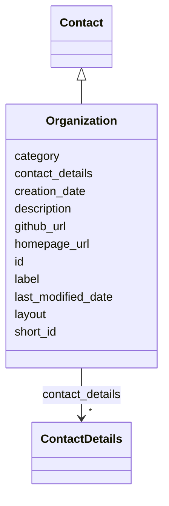

# Class: Organization


_An organization._


URI: [kgr:Organization](https://w3id.org/bridge2ai/data-sheets-schema/Organization)



```mermaid
 classDiagram
    class Organization
    click Organization href "Organization/.html"
      Contact <|-- Organization
        click Contact href "Contact/.html"

      Organization : category

      Organization : contact_details


        Organization --> "*" ContactDetails : contact_details
        click ContactDetails href "ContactDetails/.html"


      Organization : creation_date

      Organization : description

      Organization : github_url

      Organization : homepage_url

      Organization : id

      Organization : label

      Organization : last_modified_date

      Organization : layout

      Organization : short_id


```


## Inheritance
* [Contact](Contact.html)
    * **Organization**


## Slots

| Name | Cardinality and Range | Description | Inheritance |
| ---  | --- | --- | --- |
| [id](id.html) | 1 <br/> [String](String.html) | The identifier of an entity | direct |
| [layout](layout.html) | 0..1 <br/> [String](String.html) | The layout of the entity | direct |
| [creation_date](creation_date.html) | 0..1 <br/> [Datetime](Datetime.html) | The date the entry was created | direct |
| [last_modified_date](last_modified_date.html) | 0..1 <br/> [Datetime](Datetime.html) | The date the entry was last modified | direct |
| [label](label.html) | 0..1 <br/> [String](String.html) | The name of the organization | direct |
| [short_id](short_id.html) | 0..1 <br/> [String](String.html) | A short identifier for the organization | direct |
| [description](description.html) | 0..1 <br/> [String](String.html) | A description of the organization | direct |
| [homepage_url](homepage_url.html) | 0..1 <br/> [Uriorcurie](Uriorcurie.html) | The homepage URL of the organization | direct |
| [github_url](github_url.html) | 0..1 <br/> [Uriorcurie](Uriorcurie.html) | The GitHub URL of the organization | direct |
| [category](category.html) | 0..1 <br/> [CategoryType](CategoryType.html) | The category of the entity | [Contact](Contact.html) |
| [contact_details](contact_details.html) | * <br/> [ContactDetails](ContactDetails.html) | A field for contact details, including email, GitHub, and contact-specific UR... | [Contact](Contact.html) |


## Usages

| used by | used in | type | used |
| ---  | --- | --- | --- |
| [FundingSource](FundingSource.html) | [label](label.html) | range | [Organization](Organization.html) |


## Identifier and Mapping Information


### Schema Source


* from schema: https://w3id.org/knowledge-graph-hub/kg_registry_schema


## Mappings

| Mapping Type | Mapped Value |
| ---  | ---  |
| self | kgr:Organization |
| native | kgr:Organization |


## LinkML Source

<!-- TODO: investigate https://stackoverflow.com/questions/37606292/how-to-create-tabbed-code-blocks-in-mkdocs-or-sphinx -->

### Direct

<details>
```yaml
name: Organization
description: An organization.
from_schema: https://w3id.org/knowledge-graph-hub/kg_registry_schema
is_a: Contact
slots:
- id
- layout
- creation_date
- last_modified_date
attributes:
  label:
    name: label
    description: The name of the organization.
    from_schema: https://w3id.org/knowledge-graph-hub/kg_registry_schema
    domain_of:
    - Individual
    - Organization
    - FundingSource
    - License
    - Usage
    range: string
  short_id:
    name: short_id
    description: A short identifier for the organization. This may be an acronym or
      abbreviation.
    from_schema: https://w3id.org/knowledge-graph-hub/kg_registry_schema
    rank: 1000
    domain_of:
    - Organization
    range: string
  description:
    name: description
    description: A description of the organization.
    from_schema: https://w3id.org/knowledge-graph-hub/kg_registry_schema
    domain_of:
    - Resource
    - Product
    - Organization
    - Usage
    range: string
  homepage_url:
    name: homepage_url
    description: The homepage URL of the organization.
    from_schema: https://w3id.org/knowledge-graph-hub/kg_registry_schema
    domain_of:
    - Resource
    - Organization
    range: uriorcurie
  github_url:
    name: github_url
    description: The GitHub URL of the organization.
    from_schema: https://w3id.org/knowledge-graph-hub/kg_registry_schema
    rank: 1000
    domain_of:
    - Organization
    range: uriorcurie

```
</details>

### Induced

<details>
```yaml
name: Organization
description: An organization.
from_schema: https://w3id.org/knowledge-graph-hub/kg_registry_schema
is_a: Contact
attributes:
  label:
    name: label
    description: The name of the organization.
    from_schema: https://w3id.org/knowledge-graph-hub/kg_registry_schema
    alias: label
    owner: Organization
    domain_of:
    - Individual
    - Organization
    - FundingSource
    - License
    - Usage
    range: string
  short_id:
    name: short_id
    description: A short identifier for the organization. This may be an acronym or
      abbreviation.
    from_schema: https://w3id.org/knowledge-graph-hub/kg_registry_schema
    rank: 1000
    alias: short_id
    owner: Organization
    domain_of:
    - Organization
    range: string
  description:
    name: description
    description: A description of the organization.
    from_schema: https://w3id.org/knowledge-graph-hub/kg_registry_schema
    alias: description
    owner: Organization
    domain_of:
    - Resource
    - Product
    - Organization
    - Usage
    range: string
  homepage_url:
    name: homepage_url
    description: The homepage URL of the organization.
    from_schema: https://w3id.org/knowledge-graph-hub/kg_registry_schema
    alias: homepage_url
    owner: Organization
    domain_of:
    - Resource
    - Organization
    range: uriorcurie
  github_url:
    name: github_url
    description: The GitHub URL of the organization.
    from_schema: https://w3id.org/knowledge-graph-hub/kg_registry_schema
    rank: 1000
    alias: github_url
    owner: Organization
    domain_of:
    - Organization
    range: uriorcurie
  id:
    name: id
    description: The identifier of an entity. This is used to identify it within the
      registry.
    from_schema: https://w3id.org/knowledge-graph-hub/kg_registry_schema
    rank: 1000
    slot_uri: dcterms:identifier
    identifier: true
    alias: id
    owner: Organization
    domain_of:
    - NamedThing
    - Organization
    range: string
    required: true
  layout:
    name: layout
    description: The layout of the entity. This is used to determine how to display
      the entity in the web interface. For resources, this is generally 'resource_detail'.
      For products, this is generally 'product_detail'. If a value for this slot is
      not specified, pages won't contain anything from their header metadata.
    from_schema: https://w3id.org/knowledge-graph-hub/kg_registry_schema
    rank: 1000
    alias: layout
    owner: Organization
    domain_of:
    - NamedThing
    - Organization
    range: string
  creation_date:
    name: creation_date
    description: The date the entry was created. This is used to determine the age
      of the entity. It should be in ISO 8601 format, e.g., 2024-02-12T00:00:00Z.
    from_schema: https://w3id.org/knowledge-graph-hub/kg_registry_schema
    rank: 1000
    alias: creation_date
    owner: Organization
    domain_of:
    - NamedThing
    - Organization
    range: datetime
  last_modified_date:
    name: last_modified_date
    description: The date the entry was last modified. It should be in ISO 8601 format,
      e.g., 2024-02-12T00:00:00Z.
    from_schema: https://w3id.org/knowledge-graph-hub/kg_registry_schema
    rank: 1000
    alias: last_modified_date
    owner: Organization
    domain_of:
    - NamedThing
    - Organization
    range: datetime
  category:
    name: category
    description: The category of the entity. This should be identical to its class
      name.
    from_schema: https://w3id.org/knowledge-graph-hub/kg_registry_schema
    rank: 1000
    is_a: type
    domain: NamedThing
    alias: category
    owner: Organization
    domain_of:
    - NamedThing
    - Contact
    range: category_type
  contact_details:
    name: contact_details
    description: A field for contact details, including email, GitHub, and contact-specific
      URLs.
    from_schema: https://w3id.org/knowledge-graph-hub/kg_registry_schema
    rank: 1000
    alias: contact_details
    owner: Organization
    domain_of:
    - Contact
    range: ContactDetails
    multivalued: true
    inlined: true
    inlined_as_list: true

```
</details>
