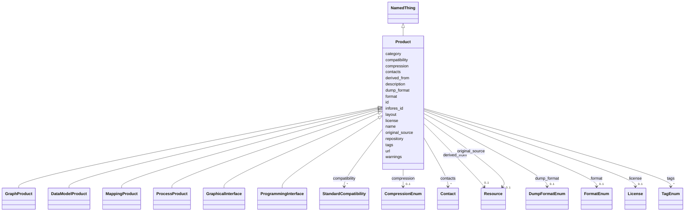

# Class: Product


_A top-level class for all products in the knowledge graph registry. This includes any specific files, APIs, or any other accessible representations of a resource._


URI: [kgr:Product](https://w3id.org/bridge2ai/data-sheets-schema/Product)





## Inheritance
* [NamedThing](NamedThing.html)
    * **Product**
        * [GraphProduct](GraphProduct.html)
        * [DataModelProduct](DataModelProduct.html)
        * [MappingProduct](MappingProduct.html)
        * [ProcessProduct](ProcessProduct.html)
        * [GraphicalInterface](GraphicalInterface.html)
        * [ProgrammingInterface](ProgrammingInterface.html)


## Slots

| Name | Cardinality and Range | Description | Inheritance |
| ---  | --- | --- | --- |
| [name](name.html) | 1 <br/> [String](String.html) | The human-readable name of the product | direct |
| [description](description.html) | 0..1 <br/> [String](String.html) | A description of the product | direct |
| [original_source](original_source.html) | 0..1 <br/> [Resource](Resource.html) | The original source of the product | direct |
| [derived_from](derived_from.html) | 0..1 <br/> [Resource](Resource.html) | The resource that the product is derived from | direct |
| [url](url.html) | 0..1 <br/> [Uriorcurie](Uriorcurie.html) | The URL of the product | direct |
| [repository](repository.html) | 0..1 <br/> [Uriorcurie](Uriorcurie.html) | A main version control repository for the product | direct |
| [license](license.html) | 0..1 <br/> [License](License.html) | The license of the product | direct |
| [compression](compression.html) | 0..1 <br/> [CompressionEnum](CompressionEnum.html) | The type of compression used with the product | direct |
| [contacts](contacts.html) | * <br/> [Contact](Contact.html) | The contact points for the product | direct |
| [tags](tags.html) | * <br/> [TagEnum](TagEnum.html) | Tags associated with the product | direct |
| [infores_id](infores_id.html) | 0..1 <br/> [String](String.html) | The Infores ID of the product | direct |
| [compatibility](compatibility.html) | * <br/> [StandardCompatibility](StandardCompatibility.html) | A list of standards that the product conforms to | direct |
| [format](format.html) | 0..1 <br/> [FormatEnum](FormatEnum.html) | The format or serialization of the product | direct |
| [dump_format](dump_format.html) | 0..1 <br/> [DumpFormatEnum](DumpFormatEnum.html) | The format of a dump of the product as a file | direct |
| [id](id.html) | 1 <br/> [String](String.html) | The identifier of an entity | [NamedThing](NamedThing.html) |
| [category](category.html) | 0..1 <br/> [CategoryType](CategoryType.html) | The category of the entity | [NamedThing](NamedThing.html) |
| [warnings](warnings.html) | * <br/> [String](String.html) | A list of warnings about an item to be displayed in the interface | [NamedThing](NamedThing.html) |
| [layout](layout.html) | 0..1 <br/> [String](String.html) | The layout of the entity | [NamedThing](NamedThing.html) |


## Usages

| used by | used in | type | used |
| ---  | --- | --- | --- |
| [Resource](Resource.html) | [products](products.html) | range | [Product](Product.html) |
| [KnowledgeGraph](KnowledgeGraph.html) | [products](products.html) | range | [Product](Product.html) |
| [DataSource](DataSource.html) | [products](products.html) | range | [Product](Product.html) |
| [DataModel](DataModel.html) | [products](products.html) | range | [Product](Product.html) |
| [Aggregator](Aggregator.html) | [products](products.html) | range | [Product](Product.html) |


## Identifier and Mapping Information


### Schema Source


* from schema: https://w3id.org/knowledge-graph-hub/kg_registry_schema


## Mappings

| Mapping Type | Mapped Value |
| ---  | ---  |
| self | kgr:Product |
| native | kgr:Product |


## LinkML Source

<!-- TODO: investigate https://stackoverflow.com/questions/37606292/how-to-create-tabbed-code-blocks-in-mkdocs-or-sphinx -->

### Direct

<details>
```yaml
name: Product
description: A top-level class for all products in the knowledge graph registry. This
  includes any specific files, APIs, or any other accessible representations of a
  resource.
from_schema: https://w3id.org/knowledge-graph-hub/kg_registry_schema
is_a: NamedThing
attributes:
  name:
    name: name
    description: The human-readable name of the product.
    from_schema: https://w3id.org/knowledge-graph-hub/kg_registry_schema
    domain_of:
    - Resource
    - Product
    range: string
    required: true
  description:
    name: description
    description: A description of the product.
    from_schema: https://w3id.org/knowledge-graph-hub/kg_registry_schema
    domain_of:
    - Resource
    - Product
    - Usage
    range: string
  original_source:
    name: original_source
    description: The original source of the product. This only needs to be the identifier
      of the resource. This may be the parent resource or another resource. Note this
      is not the same as components of a graph; this should only be used when a single
      source is known.
    from_schema: https://w3id.org/knowledge-graph-hub/kg_registry_schema
    rank: 1000
    domain_of:
    - Product
    range: Resource
  derived_from:
    name: derived_from
    description: The resource that the product is derived from. This only needs to
      be the identifier of the resource. It may be the parent resource or another
      resource, e.g., an Aggregator.
    from_schema: https://w3id.org/knowledge-graph-hub/kg_registry_schema
    rank: 1000
    domain_of:
    - Product
    range: Resource
  url:
    name: url
    description: The URL of the product. This may be a link to download a specific
      file, a base URL to an API, or a link to a graphical interface.
    from_schema: https://w3id.org/knowledge-graph-hub/kg_registry_schema
    rank: 1000
    domain_of:
    - Product
    - Organization
    - Usage
    range: uriorcurie
  repository:
    name: repository
    description: A main version control repository for the product.
    from_schema: https://w3id.org/knowledge-graph-hub/kg_registry_schema
    domain_of:
    - Resource
    - Product
    range: uriorcurie
  license:
    name: license
    description: The license of the product. This may differ from that of the parent
      resource.
    from_schema: https://w3id.org/knowledge-graph-hub/kg_registry_schema
    domain_of:
    - Resource
    - Product
    range: License
    inlined: true
  compression:
    name: compression
    description: The type of compression used with the product. If this is not specified,
      it is assumed to be uncompressed.
    from_schema: https://w3id.org/knowledge-graph-hub/kg_registry_schema
    rank: 1000
    domain_of:
    - Product
    range: CompressionEnum
  contacts:
    name: contacts
    description: The contact points for the product. May be an individual or organization.
    from_schema: https://w3id.org/knowledge-graph-hub/kg_registry_schema
    domain_of:
    - Resource
    - Product
    range: Contact
    multivalued: true
  tags:
    name: tags
    description: Tags associated with the product.
    from_schema: https://w3id.org/knowledge-graph-hub/kg_registry_schema
    domain_of:
    - Resource
    - Product
    range: TagEnum
    multivalued: true
  infores_id:
    name: infores_id
    description: The Infores ID of the product. Do not include the 'infores' prefix.
    from_schema: https://w3id.org/knowledge-graph-hub/kg_registry_schema
    domain_of:
    - Resource
    - Product
    range: string
  compatibility:
    name: compatibility
    description: A list of standards that the product conforms to. This is not the
      same as its serialization/format.
    from_schema: https://w3id.org/knowledge-graph-hub/kg_registry_schema
    rank: 1000
    domain_of:
    - Product
    range: StandardCompatibility
    multivalued: true
    inlined: true
  format:
    name: format
    description: The format or serialization of the product. Generally corresponds
      to the file extension.
    from_schema: https://w3id.org/knowledge-graph-hub/kg_registry_schema
    rank: 1000
    domain_of:
    - Product
    range: FormatEnum
  dump_format:
    name: dump_format
    description: The format of a dump of the product as a file. Note the product may
      also be compressed.
    from_schema: https://w3id.org/knowledge-graph-hub/kg_registry_schema
    rank: 1000
    domain_of:
    - Product
    range: DumpFormatEnum

```
</details>

### Induced

<details>
```yaml
name: Product
description: A top-level class for all products in the knowledge graph registry. This
  includes any specific files, APIs, or any other accessible representations of a
  resource.
from_schema: https://w3id.org/knowledge-graph-hub/kg_registry_schema
is_a: NamedThing
attributes:
  name:
    name: name
    description: The human-readable name of the product.
    from_schema: https://w3id.org/knowledge-graph-hub/kg_registry_schema
    alias: name
    owner: Product
    domain_of:
    - Resource
    - Product
    range: string
    required: true
  description:
    name: description
    description: A description of the product.
    from_schema: https://w3id.org/knowledge-graph-hub/kg_registry_schema
    alias: description
    owner: Product
    domain_of:
    - Resource
    - Product
    - Usage
    range: string
  original_source:
    name: original_source
    description: The original source of the product. This only needs to be the identifier
      of the resource. This may be the parent resource or another resource. Note this
      is not the same as components of a graph; this should only be used when a single
      source is known.
    from_schema: https://w3id.org/knowledge-graph-hub/kg_registry_schema
    rank: 1000
    alias: original_source
    owner: Product
    domain_of:
    - Product
    range: Resource
  derived_from:
    name: derived_from
    description: The resource that the product is derived from. This only needs to
      be the identifier of the resource. It may be the parent resource or another
      resource, e.g., an Aggregator.
    from_schema: https://w3id.org/knowledge-graph-hub/kg_registry_schema
    rank: 1000
    alias: derived_from
    owner: Product
    domain_of:
    - Product
    range: Resource
  url:
    name: url
    description: The URL of the product. This may be a link to download a specific
      file, a base URL to an API, or a link to a graphical interface.
    from_schema: https://w3id.org/knowledge-graph-hub/kg_registry_schema
    rank: 1000
    alias: url
    owner: Product
    domain_of:
    - Product
    - Organization
    - Usage
    range: uriorcurie
  repository:
    name: repository
    description: A main version control repository for the product.
    from_schema: https://w3id.org/knowledge-graph-hub/kg_registry_schema
    alias: repository
    owner: Product
    domain_of:
    - Resource
    - Product
    range: uriorcurie
  license:
    name: license
    description: The license of the product. This may differ from that of the parent
      resource.
    from_schema: https://w3id.org/knowledge-graph-hub/kg_registry_schema
    alias: license
    owner: Product
    domain_of:
    - Resource
    - Product
    range: License
    inlined: true
  compression:
    name: compression
    description: The type of compression used with the product. If this is not specified,
      it is assumed to be uncompressed.
    from_schema: https://w3id.org/knowledge-graph-hub/kg_registry_schema
    rank: 1000
    alias: compression
    owner: Product
    domain_of:
    - Product
    range: CompressionEnum
  contacts:
    name: contacts
    description: The contact points for the product. May be an individual or organization.
    from_schema: https://w3id.org/knowledge-graph-hub/kg_registry_schema
    alias: contacts
    owner: Product
    domain_of:
    - Resource
    - Product
    range: Contact
    multivalued: true
  tags:
    name: tags
    description: Tags associated with the product.
    from_schema: https://w3id.org/knowledge-graph-hub/kg_registry_schema
    alias: tags
    owner: Product
    domain_of:
    - Resource
    - Product
    range: TagEnum
    multivalued: true
  infores_id:
    name: infores_id
    description: The Infores ID of the product. Do not include the 'infores' prefix.
    from_schema: https://w3id.org/knowledge-graph-hub/kg_registry_schema
    alias: infores_id
    owner: Product
    domain_of:
    - Resource
    - Product
    range: string
  compatibility:
    name: compatibility
    description: A list of standards that the product conforms to. This is not the
      same as its serialization/format.
    from_schema: https://w3id.org/knowledge-graph-hub/kg_registry_schema
    rank: 1000
    alias: compatibility
    owner: Product
    domain_of:
    - Product
    range: StandardCompatibility
    multivalued: true
    inlined: true
  format:
    name: format
    description: The format or serialization of the product. Generally corresponds
      to the file extension.
    from_schema: https://w3id.org/knowledge-graph-hub/kg_registry_schema
    rank: 1000
    alias: format
    owner: Product
    domain_of:
    - Product
    range: FormatEnum
  dump_format:
    name: dump_format
    description: The format of a dump of the product as a file. Note the product may
      also be compressed.
    from_schema: https://w3id.org/knowledge-graph-hub/kg_registry_schema
    rank: 1000
    alias: dump_format
    owner: Product
    domain_of:
    - Product
    range: DumpFormatEnum
  id:
    name: id
    description: The identifier of an entity. This is used to identify it within the
      registry.
    from_schema: https://w3id.org/knowledge-graph-hub/kg_registry_schema
    rank: 1000
    slot_uri: dcterms:identifier
    identifier: true
    alias: id
    owner: Product
    domain_of:
    - NamedThing
    range: string
    required: true
  category:
    name: category
    description: The category of the entity. This should be identical to its class
      name.
    from_schema: https://w3id.org/knowledge-graph-hub/kg_registry_schema
    rank: 1000
    is_a: type
    domain: NamedThing
    alias: category
    owner: Product
    domain_of:
    - NamedThing
    - Contact
    range: category_type
  warnings:
    name: warnings
    description: A list of warnings about an item to be displayed in the interface.
      These should primarily warn users about unavailable resources, broken links,
      and other obstacles to using a resource.
    from_schema: https://w3id.org/knowledge-graph-hub/kg_registry_schema
    rank: 1000
    alias: warnings
    owner: Product
    domain_of:
    - NamedThing
    range: string
    multivalued: true
    inlined: true
    inlined_as_list: true
  layout:
    name: layout
    description: The layout of the entity. This is used to determine how to display
      the entity in the web interface. For resources, this is generally 'resource_detail'.
      For products, this is generally 'product_detail'.
    from_schema: https://w3id.org/knowledge-graph-hub/kg_registry_schema
    rank: 1000
    alias: layout
    owner: Product
    domain_of:
    - NamedThing
    range: string

```
</details>
