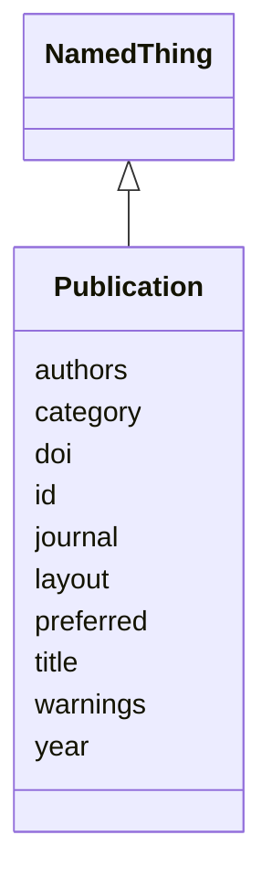

# Class: Publication


_A publication associated with a resource. Its id should be a DOI (with prefix), but a URL is acceptable if a DOI is not available._


URI: [kgr:Publication](https://w3id.org/bridge2ai/data-sheets-schema/Publication)





## Inheritance
* [NamedThing](NamedThing.html)
    * **Publication**


## Slots

| Name | Cardinality and Range | Description | Inheritance |
| ---  | --- | --- | --- |
| [preferred](preferred.html) | 0..1 <br/> [Boolean](Boolean.html) | Whether this is the preferred publication for the resource | direct |
| [title](title.html) | 0..1 <br/> [String](String.html) | The title of the publication | direct |
| [authors](authors.html) | * <br/> [String](String.html) | The authors of the publication | direct |
| [journal](journal.html) | 0..1 <br/> [String](String.html) | The journal the publication was published in | direct |
| [year](year.html) | 0..1 <br/> [String](String.html) | The year the publication was published | direct |
| [doi](doi.html) | 0..1 <br/> [Uriorcurie](Uriorcurie.html) | The DOI of the publication | direct |
| [id](id.html) | 1 <br/> [String](String.html) | The identifier of an entity | [NamedThing](NamedThing.html) |
| [category](category.html) | 0..1 <br/> [CategoryType](CategoryType.html) | The category of the entity | [NamedThing](NamedThing.html) |
| [warnings](warnings.html) | * <br/> [String](String.html) | A list of warnings about an item to be displayed in the interface | [NamedThing](NamedThing.html) |
| [layout](layout.html) | 0..1 <br/> [String](String.html) | The layout of the entity | [NamedThing](NamedThing.html) |


## Usages

| used by | used in | type | used |
| ---  | --- | --- | --- |
| [Resource](Resource.html) | [publications](publications.html) | range | [Publication](Publication.html) |
| [KnowledgeGraph](KnowledgeGraph.html) | [publications](publications.html) | range | [Publication](Publication.html) |
| [DataSource](DataSource.html) | [publications](publications.html) | range | [Publication](Publication.html) |
| [DataModel](DataModel.html) | [publications](publications.html) | range | [Publication](Publication.html) |
| [Aggregator](Aggregator.html) | [publications](publications.html) | range | [Publication](Publication.html) |
| [Usage](Usage.html) | [publications](publications.html) | range | [Publication](Publication.html) |


## Identifier and Mapping Information


### Schema Source


* from schema: https://w3id.org/knowledge-graph-hub/kg_registry_schema


## Mappings

| Mapping Type | Mapped Value |
| ---  | ---  |
| self | kgr:Publication |
| native | kgr:Publication |


## LinkML Source

<!-- TODO: investigate https://stackoverflow.com/questions/37606292/how-to-create-tabbed-code-blocks-in-mkdocs-or-sphinx -->

### Direct

<details>
```yaml
name: Publication
description: A publication associated with a resource. Its id should be a DOI (with
  prefix), but a URL is acceptable if a DOI is not available.
from_schema: https://w3id.org/knowledge-graph-hub/kg_registry_schema
is_a: NamedThing
attributes:
  preferred:
    name: preferred
    description: Whether this is the preferred publication for the resource.
    from_schema: https://w3id.org/knowledge-graph-hub/kg_registry_schema
    rank: 1000
    domain_of:
    - Publication
    range: boolean
  title:
    name: title
    description: The title of the publication.
    from_schema: https://w3id.org/knowledge-graph-hub/kg_registry_schema
    rank: 1000
    domain_of:
    - Publication
    range: string
  authors:
    name: authors
    description: The authors of the publication.
    from_schema: https://w3id.org/knowledge-graph-hub/kg_registry_schema
    rank: 1000
    domain_of:
    - Publication
    range: string
    multivalued: true
  journal:
    name: journal
    description: The journal the publication was published in.
    from_schema: https://w3id.org/knowledge-graph-hub/kg_registry_schema
    rank: 1000
    domain_of:
    - Publication
    range: string
  year:
    name: year
    description: The year the publication was published.
    from_schema: https://w3id.org/knowledge-graph-hub/kg_registry_schema
    rank: 1000
    domain_of:
    - Publication
    range: string
  doi:
    name: doi
    description: 'The DOI of the publication. This should include the doi: prefix.'
    from_schema: https://w3id.org/knowledge-graph-hub/kg_registry_schema
    rank: 1000
    domain_of:
    - Publication
    range: uriorcurie

```
</details>

### Induced

<details>
```yaml
name: Publication
description: A publication associated with a resource. Its id should be a DOI (with
  prefix), but a URL is acceptable if a DOI is not available.
from_schema: https://w3id.org/knowledge-graph-hub/kg_registry_schema
is_a: NamedThing
attributes:
  preferred:
    name: preferred
    description: Whether this is the preferred publication for the resource.
    from_schema: https://w3id.org/knowledge-graph-hub/kg_registry_schema
    rank: 1000
    alias: preferred
    owner: Publication
    domain_of:
    - Publication
    range: boolean
  title:
    name: title
    description: The title of the publication.
    from_schema: https://w3id.org/knowledge-graph-hub/kg_registry_schema
    rank: 1000
    alias: title
    owner: Publication
    domain_of:
    - Publication
    range: string
  authors:
    name: authors
    description: The authors of the publication.
    from_schema: https://w3id.org/knowledge-graph-hub/kg_registry_schema
    rank: 1000
    alias: authors
    owner: Publication
    domain_of:
    - Publication
    range: string
    multivalued: true
  journal:
    name: journal
    description: The journal the publication was published in.
    from_schema: https://w3id.org/knowledge-graph-hub/kg_registry_schema
    rank: 1000
    alias: journal
    owner: Publication
    domain_of:
    - Publication
    range: string
  year:
    name: year
    description: The year the publication was published.
    from_schema: https://w3id.org/knowledge-graph-hub/kg_registry_schema
    rank: 1000
    alias: year
    owner: Publication
    domain_of:
    - Publication
    range: string
  doi:
    name: doi
    description: 'The DOI of the publication. This should include the doi: prefix.'
    from_schema: https://w3id.org/knowledge-graph-hub/kg_registry_schema
    rank: 1000
    alias: doi
    owner: Publication
    domain_of:
    - Publication
    range: uriorcurie
  id:
    name: id
    description: The identifier of an entity. This is used to identify it within the
      registry.
    from_schema: https://w3id.org/knowledge-graph-hub/kg_registry_schema
    rank: 1000
    slot_uri: dcterms:identifier
    identifier: true
    alias: id
    owner: Publication
    domain_of:
    - NamedThing
    range: string
    required: true
  category:
    name: category
    description: The category of the entity. This should be identical to its class
      name.
    from_schema: https://w3id.org/knowledge-graph-hub/kg_registry_schema
    rank: 1000
    is_a: type
    domain: NamedThing
    alias: category
    owner: Publication
    domain_of:
    - NamedThing
    - Contact
    range: category_type
  warnings:
    name: warnings
    description: A list of warnings about an item to be displayed in the interface.
      These should primarily warn users about unavailable resources, broken links,
      and other obstacles to using a resource.
    from_schema: https://w3id.org/knowledge-graph-hub/kg_registry_schema
    rank: 1000
    alias: warnings
    owner: Publication
    domain_of:
    - NamedThing
    range: string
    multivalued: true
    inlined: true
    inlined_as_list: true
  layout:
    name: layout
    description: The layout of the entity. This is used to determine how to display
      the entity in the web interface. For resources, this is generally 'resource_detail'.
      For products, this is generally 'product_detail'.
    from_schema: https://w3id.org/knowledge-graph-hub/kg_registry_schema
    rank: 1000
    alias: layout
    owner: Publication
    domain_of:
    - NamedThing
    range: string

```
</details>
