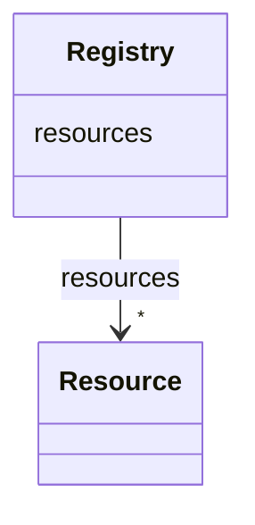

# Class: Registry


_A registry of knowledge graphs and their components._


URI: [kgr:Registry](https://w3id.org/bridge2ai/data-sheets-schema/Registry)





<!-- no inheritance hierarchy -->


## Slots

| Name | Cardinality and Range | Description | Inheritance |
| ---  | --- | --- | --- |
| [resources](resources.html) | * <br/> [Resource](Resource.html) | A list of entries in the registry | direct |


## Identifier and Mapping Information


### Schema Source


* from schema: https://w3id.org/knowledge-graph-hub/kg_registry_schema


## Mappings

| Mapping Type | Mapped Value |
| ---  | ---  |
| self | kgr:Registry |
| native | kgr:Registry |


## LinkML Source

<!-- TODO: investigate https://stackoverflow.com/questions/37606292/how-to-create-tabbed-code-blocks-in-mkdocs-or-sphinx -->

### Direct

<details>
```yaml
name: Registry
description: A registry of knowledge graphs and their components.
from_schema: https://w3id.org/knowledge-graph-hub/kg_registry_schema
slots:
- resources

```
</details>

### Induced

<details>
```yaml
name: Registry
description: A registry of knowledge graphs and their components.
from_schema: https://w3id.org/knowledge-graph-hub/kg_registry_schema
attributes:
  resources:
    name: resources
    description: A list of entries in the registry.
    from_schema: https://w3id.org/knowledge-graph-hub/kg_registry_schema
    rank: 1000
    alias: resources
    owner: Registry
    domain_of:
    - Registry
    range: Resource
    multivalued: true
    inlined: true
    inlined_as_list: true

```
</details>
