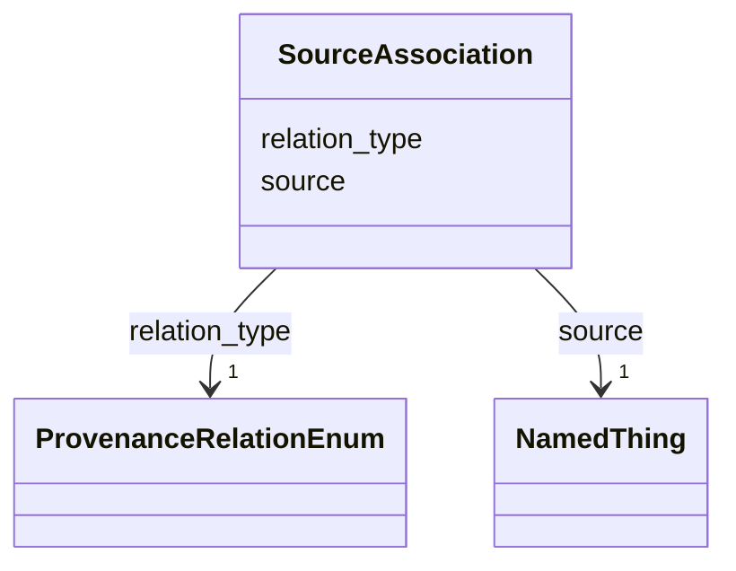

# Class: SourceAssociation


_A typed provenance association from a product to another resource or product that served as a source, input, influence, or other provenance-related contributor._


URI: [kgr:SourceAssociation](https://w3id.org/bridge2ai/data-sheets-schema/SourceAssociation)





<!-- no inheritance hierarchy -->


## Slots

| Name | Cardinality and Range | Description | Inheritance |
| ---  | --- | --- | --- |
| [source](source.html) | 1 <br/> [NamedThing](NamedThing.html)&nbsp;or&nbsp;<br />[Resource](Resource.html)&nbsp;or&nbsp;<br />[Product](Product.html) | The identifier of the resource or product that is related to the product thro... | direct |
| [relation_type](relation_type.html) | 1 <br/> [ProvenanceRelationEnum](ProvenanceRelationEnum.html) | The PROV-O relation type that describes how the product is related to the sou... | direct |


## Usages

| used by | used in | type | used |
| ---  | --- | --- | --- |
| [Product](Product.html) | [original_source](original_source.html) | range | [SourceAssociation](SourceAssociation.html) |
| [Product](Product.html) | [secondary_source](secondary_source.html) | range | [SourceAssociation](SourceAssociation.html) |
| [GraphProduct](GraphProduct.html) | [original_source](original_source.html) | range | [SourceAssociation](SourceAssociation.html) |
| [GraphProduct](GraphProduct.html) | [secondary_source](secondary_source.html) | range | [SourceAssociation](SourceAssociation.html) |
| [DataModelProduct](DataModelProduct.html) | [original_source](original_source.html) | range | [SourceAssociation](SourceAssociation.html) |
| [DataModelProduct](DataModelProduct.html) | [secondary_source](secondary_source.html) | range | [SourceAssociation](SourceAssociation.html) |
| [OntologyProduct](OntologyProduct.html) | [original_source](original_source.html) | range | [SourceAssociation](SourceAssociation.html) |
| [OntologyProduct](OntologyProduct.html) | [secondary_source](secondary_source.html) | range | [SourceAssociation](SourceAssociation.html) |
| [MappingProduct](MappingProduct.html) | [original_source](original_source.html) | range | [SourceAssociation](SourceAssociation.html) |
| [MappingProduct](MappingProduct.html) | [secondary_source](secondary_source.html) | range | [SourceAssociation](SourceAssociation.html) |
| [ProcessProduct](ProcessProduct.html) | [original_source](original_source.html) | range | [SourceAssociation](SourceAssociation.html) |
| [ProcessProduct](ProcessProduct.html) | [secondary_source](secondary_source.html) | range | [SourceAssociation](SourceAssociation.html) |
| [GraphicalInterface](GraphicalInterface.html) | [original_source](original_source.html) | range | [SourceAssociation](SourceAssociation.html) |
| [GraphicalInterface](GraphicalInterface.html) | [secondary_source](secondary_source.html) | range | [SourceAssociation](SourceAssociation.html) |
| [ProgrammingInterface](ProgrammingInterface.html) | [original_source](original_source.html) | range | [SourceAssociation](SourceAssociation.html) |
| [ProgrammingInterface](ProgrammingInterface.html) | [secondary_source](secondary_source.html) | range | [SourceAssociation](SourceAssociation.html) |
| [DocumentationProduct](DocumentationProduct.html) | [original_source](original_source.html) | range | [SourceAssociation](SourceAssociation.html) |
| [DocumentationProduct](DocumentationProduct.html) | [secondary_source](secondary_source.html) | range | [SourceAssociation](SourceAssociation.html) |


## Identifier and Mapping Information


### Schema Source


* from schema: https://w3id.org/knowledge-graph-hub/kg_registry_schema


## Mappings

| Mapping Type | Mapped Value |
| ---  | ---  |
| self | kgr:SourceAssociation |
| native | kgr:SourceAssociation |


## LinkML Source

<!-- TODO: investigate https://stackoverflow.com/questions/37606292/how-to-create-tabbed-code-blocks-in-mkdocs-or-sphinx -->

### Direct

<details>
```yaml
name: SourceAssociation
description: A typed provenance association from a product to another resource or
  product that served as a source, input, influence, or other provenance-related contributor.
from_schema: https://w3id.org/knowledge-graph-hub/kg_registry_schema
attributes:
  source:
    name: source
    description: The identifier of the resource or product that is related to the
      product through this provenance association.
    from_schema: https://w3id.org/knowledge-graph-hub/kg_registry_schema
    rank: 1000
    domain_of:
    - SourceAssociation
    range: NamedThing
    required: true
    any_of:
    - range: Resource
    - range: Product
  relation_type:
    name: relation_type
    description: The PROV-O relation type that describes how the product is related
      to the source.
    from_schema: https://w3id.org/knowledge-graph-hub/kg_registry_schema
    rank: 1000
    domain_of:
    - SourceAssociation
    range: ProvenanceRelationEnum
    required: true

```
</details>

### Induced

<details>
```yaml
name: SourceAssociation
description: A typed provenance association from a product to another resource or
  product that served as a source, input, influence, or other provenance-related contributor.
from_schema: https://w3id.org/knowledge-graph-hub/kg_registry_schema
attributes:
  source:
    name: source
    description: The identifier of the resource or product that is related to the
      product through this provenance association.
    from_schema: https://w3id.org/knowledge-graph-hub/kg_registry_schema
    rank: 1000
    alias: source
    owner: SourceAssociation
    domain_of:
    - SourceAssociation
    range: NamedThing
    required: true
    any_of:
    - range: Resource
    - range: Product
  relation_type:
    name: relation_type
    description: The PROV-O relation type that describes how the product is related
      to the source.
    from_schema: https://w3id.org/knowledge-graph-hub/kg_registry_schema
    rank: 1000
    alias: relation_type
    owner: SourceAssociation
    domain_of:
    - SourceAssociation
    range: ProvenanceRelationEnum
    required: true

```
</details>
