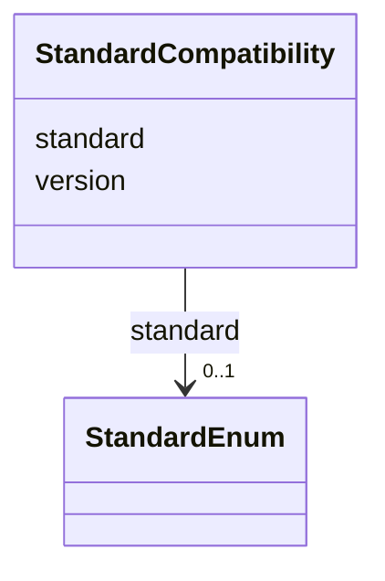

# Class: StandardCompatibility


_Details about the compatibility of a product with a particular standard, including data models such as Biolink Model and graph standards such as KGX._


URI: [kgr:StandardCompatibility](https://w3id.org/bridge2ai/data-sheets-schema/StandardCompatibility)





<!-- no inheritance hierarchy -->


## Slots

| Name | Cardinality and Range | Description | Inheritance |
| ---  | --- | --- | --- |
| [standard](standard.html) | 0..1 <br/> [StandardEnum](StandardEnum.html) | The name of the standard that the product is compatible with | direct |
| [version](version.html) | 0..1 <br/> [String](String.html) | If applicable, the most recent version of the standard that the product is kn... | direct |


## Usages

| used by | used in | type | used |
| ---  | --- | --- | --- |
| [Product](Product.html) | [compatibility](compatibility.html) | range | [StandardCompatibility](StandardCompatibility.html) |
| [GraphProduct](GraphProduct.html) | [compatibility](compatibility.html) | range | [StandardCompatibility](StandardCompatibility.html) |
| [DataModelProduct](DataModelProduct.html) | [compatibility](compatibility.html) | range | [StandardCompatibility](StandardCompatibility.html) |
| [MappingProduct](MappingProduct.html) | [compatibility](compatibility.html) | range | [StandardCompatibility](StandardCompatibility.html) |
| [ProcessProduct](ProcessProduct.html) | [compatibility](compatibility.html) | range | [StandardCompatibility](StandardCompatibility.html) |
| [GraphicalInterface](GraphicalInterface.html) | [compatibility](compatibility.html) | range | [StandardCompatibility](StandardCompatibility.html) |
| [ProgrammingInterface](ProgrammingInterface.html) | [compatibility](compatibility.html) | range | [StandardCompatibility](StandardCompatibility.html) |


## Identifier and Mapping Information


### Schema Source


* from schema: https://w3id.org/knowledge-graph-hub/kg_registry_schema


## Mappings

| Mapping Type | Mapped Value |
| ---  | ---  |
| self | kgr:StandardCompatibility |
| native | kgr:StandardCompatibility |


## LinkML Source

<!-- TODO: investigate https://stackoverflow.com/questions/37606292/how-to-create-tabbed-code-blocks-in-mkdocs-or-sphinx -->

### Direct

<details>
```yaml
name: StandardCompatibility
description: Details about the compatibility of a product with a particular standard,
  including data models such as Biolink Model and graph standards such as KGX.
from_schema: https://w3id.org/knowledge-graph-hub/kg_registry_schema
attributes:
  standard:
    name: standard
    description: The name of the standard that the product is compatible with.
    from_schema: https://w3id.org/knowledge-graph-hub/kg_registry_schema
    rank: 1000
    domain_of:
    - StandardCompatibility
    range: StandardEnum
  version:
    name: version
    description: If applicable, the most recent version of the standard that the product
      is known to be compatible with, e.g., 4.2.5
    from_schema: https://w3id.org/knowledge-graph-hub/kg_registry_schema
    domain_of:
    - Resource
    - StandardCompatibility
    range: string

```
</details>

### Induced

<details>
```yaml
name: StandardCompatibility
description: Details about the compatibility of a product with a particular standard,
  including data models such as Biolink Model and graph standards such as KGX.
from_schema: https://w3id.org/knowledge-graph-hub/kg_registry_schema
attributes:
  standard:
    name: standard
    description: The name of the standard that the product is compatible with.
    from_schema: https://w3id.org/knowledge-graph-hub/kg_registry_schema
    rank: 1000
    alias: standard
    owner: StandardCompatibility
    domain_of:
    - StandardCompatibility
    range: StandardEnum
  version:
    name: version
    description: If applicable, the most recent version of the standard that the product
      is known to be compatible with, e.g., 4.2.5
    from_schema: https://w3id.org/knowledge-graph-hub/kg_registry_schema
    alias: version
    owner: StandardCompatibility
    domain_of:
    - Resource
    - StandardCompatibility
    range: string

```
</details>
